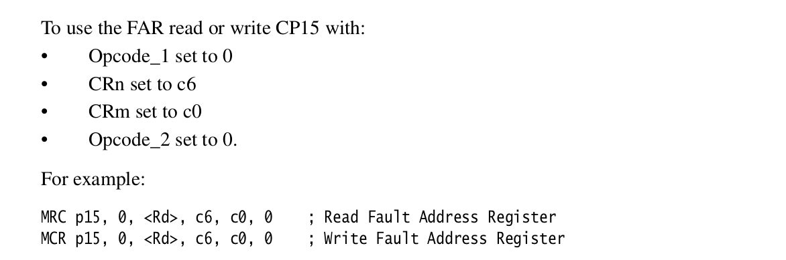

## Using debug hardware to catch mistakes

***NOTE: This lab directory has the wrong name: we are doing debug hardware***

Today is a "fetch-quest" style lab that has you setup simple breakpoint
and watchpoints.  It should mostly be defining inline assembly routines
and calling them.  Should be  fairly mechanical, straightforward but
useful lab.

Reminder:
  - Do the readings in the [./PRELAB.md](./PRELAB.md) first!    
  - The hardware documents you need are in `./docs`:
    `arm1176-ch13-debug.pdf` is the debug hardware chapter for our
    arm1176 chip and the (shorter) excerpt `arm1176-fault-regs.pdf`
    gives the fault registers.
  - There is a [cheat sheet](./../../notes/debug-hw/DEBUG-cheat-sheet.md) that summarizes a
    lot of the page numbers and rules .

The ARM chip we use, like many machines, has a way to set both
*breakpoints*, which cause a fault when the progam counter is set to
a specified address, and *watchpoints* which cause a fault when a load
or store is performed for a specified address.  These are usually used
by debuggers to run a debugged program at full-speed until a specific
location is read, written or executed.

This lab will use watchpoints as a way to detect memory corruption
efficiently.  As you know too-well by now, challenge of bare-metal
programming is that we have not had protection against memory corruption.
By this point in the quarter, I believe everyone in the class has had
to waste a bunch of time figuring out what was causing memory corruption
of some location in their program.  After today's lab you should be able
to detect such corruption quickly:

   1. Simply set a watchpoint on the address of the memory getting corrupted,
   2. When a load or store to this address occurs, you'll immediately
      get an exception, at which point you can print out the program
      counter value causing the problem (or if you're fancy, a backtrace)
      along with any other information you would find useful.

Yes, we can (and will) do memory protection with virtual memory, but that
also requires a lot of machinery and can easily make real-time guarantees
tricky.  ARM virtual memory also only provides page-level protection,
whereas the watchpoints can track a single word (or even byte).

The lab today should be around 100-200 lines of code, doesn't need
virtual memory, and if you continue to do OS or embedded stuff, will be
very useful in the future.

### Checkoff
   
   - The tests for 1 and 2 pass.
   - You code isn't ugly and has comments where you got the instructions from.
   - Possibly a part 3.
   - There's a bunch of fun extensions.

----------------------------------------------------------------------
### Background

The arm1176jzf chip we are using has multiple "debug" modes.  We are
using "monitor debug-mode" which just means that you can configure the
hardware to throw exceptions when the contents of a small set of addresses
are read, written or executed.  The manual confusingly refers to the
addresses as *modified virtual addresses* (MVAs), but as far as I can
tell, you can also use physical addresses.   (I can't find any sentence
that gives us any guarantee of this, so if you see one let me know!).

As we've seen repeatedly: 
  - The ARM will control functionality through different co-processors.  For
    debuging functionality, that is co-processor 14.
  - There will typically be a configuration register that controls whether
    the functionality is enabled or disabled.  For us, this is the
    "debug status and control register" (`DSCR`) on 13-7.

The list of the hardware debug registers is on page 13-5.

A cheat-sheet of assembly instructions to access these registers (13-26):
<table><tr><td>

</td></tr></table>

When a debug fault happens, the hardware will put additional values in
different fault registers.  A short cheat sheet of the assembly code to
get various of the fault registers:
<table><tr><td>

</td></tr></table>

-----------------------------------------------------------------------------
### 0: The pieces you need for this lab.

Much of this lab is using privileged instructions to read and write
debug registers, typically after modifying a few bits within it.
So you'll need to be clear on:
   1. How to emit inline assembly routines.
   2. How to manipulate sub-word bit-ranges 
   3. And (optionally) how to define structures that contain bitfields
      and check that these fields are the right size and offset.

We have examples for each.

##### Inline assembly for debug co-processor

A good way to get started is to see how to define inline assembly to 
access the debug ID register(`DIDR`).

For this:
  - Review the end of the [debug hardware cheat sheet](./DEBUG-cheat-sheet.md)
    where it discusses how to emit assembly.
  - The end of `armv6-debug.h` where it defines routines to access the debug 
    register.
   - Optional: define your own `cp14_didr_get()` routine to access it.

##### Bit-operations: `libc/bit-support.h`

The debug registers in cp14 are packed with different bit-sized
quantities.  There's a couple options for dealing with these:

  1. use bit-manipulation functions (`0-example-bitops.c` has examples)
  2. use structures that have fields (`0-example-debug-id.c` shows one)
  3. use raw shifts and masks.  This tends to make your code harder to follow.

For today we'll just do bit-manipulation (option 1).  While you You
can certainly write your own bit manipulation routines, it's easy to
make a mistake.  There's a bunch of routines in `libc/bit-support.h`
that you can use.

The example program `0-example-bitops.c` shows some calls.  You can 
modify it to test different things out.

##### Bit-fields.

It requires more upfront work, but can make things cleaner to specify
registers using a structure that uses bitfields (we need bitfields
since many field sizes will not not match any C datatype).
This method is often used for device driver registers.

The program `0-example-debug-id.c` gives an example.

Crucially, it's very easy to make mistakes with bitfields, so it shows how
to check the size and offset to detect mistakes.

-----------------------------------------------------------------------------
### Part 1:  set a simple watchpoint.

***NOTE:***
     - When you compile the test you'll get "used but never defined errors":
       you need to implement these routines.
     - Add all inline assembly routines  to `armv6-debug-impl.h` along with
       any helpers.
     - You will have to modify the test `1-watchpt-test.c` where it
       has `unimplemented()` invocations.

So far this quarter we've been vulnerable to load and stores of NULL
(address 0).  For example, if you run this code it will execute
"successfully"!

    #include "rpi.h"
    void notmain(void) {
        *(volatile unsigned *)0 = 0x12345678;
        printk("NULL = %x\n", *(volatile unsigned *)0);
    }

(Also: as we've seen in the original interrupt lab: we deliberately copied
exception handlers to address 0.)

As mentioned above and in the readings, the ARM chip we're using provides
*watchpoints* to trap when an address is used in a load or store and
*breakpoints* for when you try to execute the contents of an address.
The exception you receive for each is different.

For both, there will be one register that you put the address to watch in,
and a second, paired register to control what happens when the address
is used.

Note:
  - You want to look at the recipe for "how to set a simple watchpoint"
    in the debug chapter.

  - The test case for this part --- `1-watchpt-test.c` --- has some
    references to the different parts of the document you need.

With that said, we inline some of the key facts below.

To initialize co-processor 14:
  - You'll need to install exception handlers (do not enable interrupts).
  - You'll then need to enable any bits in the status register.

To set a watchpoint you can follow the recipe on 13-47.
  1. Enable monitor debugging using the `DSCR` (13-7): bits 14 and 15.
  2. Set the "watchpoint value register" (WVR) on 13-20 to 0.
  3. Set the "watchpoint control register" (WCR) on 13-21.
  4. After finishing your modifications of cp14, make sure you do a
     `prefetchflush` (see below) to make sure the processor refetches
     and re-decodes the instructions in the instuction prefetch buffer.
  5. Implement the code in the `data_abort_int` handler to check if the
     exception is from a debug exception and, if so crash with an error.

For the WCR: We don't want linking (which refers to the use of context id's).
We do want:
   - Watchpoints both in secure and non-secure;
   - For both loads and stores.
   - Both priviledged and user.
   - Enabled.
   - Byte address select for all accesses (0x0, 0x1, 0x2, 0x3).

When you are done, `2-watchpt-test.c` should pass and print `SUCCESS`.

After any modification to a co-processor 14 register, you have to do a 
`PrefetchFLush`:
<table><tr><td>

</td></tr></table>

How to get the data fault status register (DFSR, page 3-64): 
<table><tr><td>

</td></tr></table>

You can use the DFSR to get the cause of the fault from bits `0:3` if `bit[10]=0`:
<table><tr><td>

</td></tr></table>

How to get the fault address register (FAR): 
<table><tr><td>

</td></tr></table>

-----------------------------------------------------------------------------
### Part 2: set a simple breakpoint.

Test `1-brkpt-test.c` has a skeleton program to check that you can 
detect a simple breakpoint.  It sets a breakpdoint on `foo` and repeatedly
calls it: the exception handler disables the breakpoint and returns.

***NOTE:***
     - When you compile the test you'll get "used but never defined errors":
       you need to implement these routines.
     - Add all inline assembly routines  to `armv6-debug-impl.h` along with
       any helpers.
     - You will have to modify the test `2-brkpt-test.c` where it
       has `unimplemented()` invocations.

To modify part 2: note if we jump to `NULL` --- this will require setting
a breakpoint instead of a watchpoint and handling the exception in the
`prefetch_int` handler.

As above, differentiate that the exception was caused by a debug exception.

How to get the instruction fault status register (IFSR): 
<table><tr><td>

</td></tr></table>

-----------------------------------------------------------------------------
### Part 3: port your code to a simple interface

So far we've done very low level hacking to get things working --- this is
great for a time-limited situation, since there aren't much moving pieces.
It's not so great if you want to use the stuff later. 

The final part of the lab is trivially wrapping your code up in a
simple-minded interface that (1) slightly abstracts the interface and
(2) handles determining exception type and just calling the required
client handler.

  - `debug-fault.h`: interface, plus some simple accessor routines (you have to 
    define).
  - `debug-fault.c`: the rest of the interface: it keeps track of which handler
    to run.

If you do things correctly, the tests should match previous tests exactly:
  - `3-debug-watchpt.c` will generate a `.out` that matches `1-watchpt-test.c`.
  - `3-debug-brkpt.c` will generate a `.out` that matches `2-brkpt-test.c`.

Extension:
  - This interface could be more useful (we changed it in 240lx).
  - So rewrite it!
  - Alternatively: do the lab 11 in :q

-----------------------------------------------------------------------------
### Extension: make an always-on assertion system

Assertions are great, but they  have the downside that they are only
checked when you call them.  If there is only one mutation location,
this can be easy: just put the assertion there.  Unfortunately if there
are many such sites or there is corruption,  by the time you check,
too much time has passed and you can't figure out what happened.

You can use watchpoints and breakpoints to make "always on" assertions.
  1. Set a store watchpoint on a memory location.
  2. Each store to this location will cause a fault.
  3. Disable the watchpoint.
  4. Run an assert check.
  5. If it fails, give an error.

How to continue?
  1. Set a breakpoint on the next instruction.
  2. Jump back and let the mutation occur.
  3. When you get the breakpoint exception, re-enable the watchpoint and 
     disable the breakpoint.
 
-----------------------------------------------------------------------------
### Extension: handle multiple watch and breakpoints.

In general, as a safety measure, we should probably always enable
watchpoint and breakpoints on `NULL`.   However, we'd also like to be
able to catch breakpoints on other addresses.

Extend your code to add support for a second simultaneous watchpoint and
breakpoint to a different address.  In the handler differentiate it if
it is a null pointer or a from the second value.

For this:
  1. Set a breakpoint on `foo` and see that you catch it.  
  2. Set a watchpoint on a value and see that you catch it.

-----------------------------------------------------------------------------
### Extension: a more general breakpoint setup.

We hard-coded the breakpoint numbers and watchpoints to keep things simple.
You'd probably want a less architecture-specific method.  One approach
is to allocate breakpoints/watchpoints until there are no more available.

    // returns 1 if there were free breakpoints and it could set.
    // 0 otherwise. 
    int bkpt_set(uint32_t addr);
    // delete <addr>: error if wasn't already set.
    void bkpt_delete(uint32_t addr);

    // same: for watchpoints.
    int watchpt_set(uint32_t addr);
    int watchpt_delete(uint32_t addr);

Note: you may want to design your own interface. The above is likely
not the best one possible.

-----------------------------------------------------------------------------
### Extension:  Failure-oblivious computing.

Possibly the most-unsound paper in all of systems research is Rinard
et al's "Failure-oblivious computing", which made buggy server programs
"work" by handling memory corruption as follows:
   1. Discard out of bound writes.
   2. Return a random value for out of bound reads (starting at 0, 1, 2, ...).

We can only handle a single address, but we can do a similar thing.   Change
your exception code to take the complete set of registers, and restore from 
this set (so that you can change it).   
