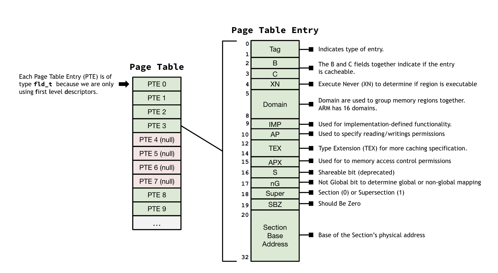

#### Introduction

A key part of a functioning operating system is a virtual memory system 
that abstracts memory access logic away from the user program. When a 
program accesses memory, it does not know or care where the physical 
memory backing the address is stored. Instead, it relies on the operating 
system and the hardware to work together to locate the right physical address 
and thus provide access to the data it wants. This mapping from physical 
address to virtual addresses is the focus of this lab. 

In this lab, we will implement the necessary infrastructure for a Memory
Managment Unit (MMU). A MMU has _two_ important functions: 
   1. Translating virtual addresses to physical addresses
   2. Controlling memory access permissions

The MMU achieves these two functions in tandem but in this introduction, we 
will try to describe the two functions separately. 

For the first function (translating virtual addresses to physical addresses), 
the MMU translates virtual addresses generated by the CPU into physical 
addresses to access external memory. Translation information resides in a 
translation table located in physical memory. The MMU provides the logic 
needed to traverse this translation table and obtain the translated
address. Translation from a virtual address to a physical address begins 
with a fetching the _First-Level Desriptor_. (More complex virtual memory 
systems also use a Second-Level Descriptor to provide more granularity, but
our system will only use a First-Level Descriptor). Each page table entry 
will map to a single section (whose information is stored in the First 
Level Descriptor) or will be marked as invalid. For this lab, there is a 
`fld_t` struct to store all of the information for a First-Level Descriptor.
At the end, your code should align with the following diagram of how the 
Page Table and Page Table Entries look in the ARMv6 vitual memory system:

<table><tr><td>
  
</td></tr></table>

For the second function (controlling memory access permissions), the MMU 
is responsible for "error checking" memory access in order to prevent 
undesirable behavior, namely faults. In the case that a fault is about to 
happen as a result of memory access, the MMU signal the fault condition 
to the CPU. In general, aborts resulting from data accesses result in data 
aborts and are acted upon by the CPU immediately. Thus, data aborts will 
result when the MMU detects an error. 

In the case that a data abort results from a memory access error, there are 
ultimately two possible outcomes: 1) remedy the error if possible, or 2) 
abort the access request. 
