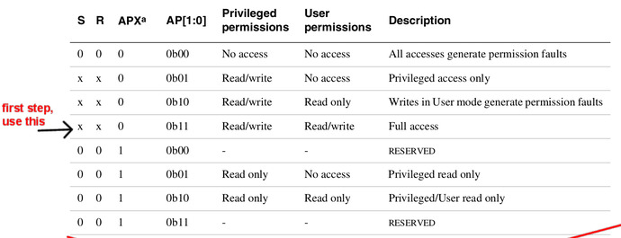
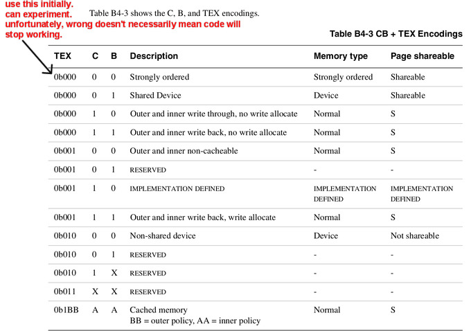

## Simple virtual memory with page tables.

  

Last lab we did a trivial virtual memory system without page tables by pinning
entries in the TLB.  This approach lets us map a reasonable amount of memory
(16MB * 8 = 128MB) without much complexity.  If you can get away with it,
I recommend this approach for embedded systems you build.  

However, for large systems this will be too limiting.  So today we do
page tables by writing the code for single-level page tables that use
1MB sections (as we used in the last lab).  This second run at VM with
a slightly different data structure hopefully helps the concepts sink
in more thoroughly.

Ideally we'd be able to run the tests from the past lab with a few small
changes --- unfortunately, there was no enough time to regularlize them
(I'm making the next lab).  Consider that a good extension!

There's a lot going on today, so the lab `README.md` has been stripped
down to mostly mechanical instructions so you have more time to look at
the code.

You can view today's and thursday's labs as fetchquests for how-do-I-do-X
where the goal is to implement everything yourself and delete our
implementations.    Today will be `staff-mmu.o` (see `mmu.c` for the
corresponding routines) and thursday will be `staff-mmu-asm.o`.

What you modify today:

   1. `armv6-vm.h`: you need to correctly use bitfields
      to control the layout of the `fld_t` first level descriptor
      structure.  The current definition will cause the static assertion
      to fail.  After your modifications the checks in `mmu-helpers.c` should
      pass.  (This file contains useful printing and checking routines.)

   2. `mmu.c`: this will hold your MMU code that manipulates
      the 1-level, section-based, page table.  The staff file
      `staff-mmu.o` provides working versions you can call.

   3. `vm-ident.c` this has simple calls to setup an identity address space.
      You should change the calls to use your implementation rather
      than staff.  (Easy: we do it this way so you can change them one
      at-a-time in case something breaks.)  

What you modify next time:

  - `arm-coprocessor-asm.h`: we don't use this header today, but will
    on thursday.  It has a fair number of instructions used to
    access the privileged state (typically using "co-processor 15").
    Sometimes the arm docs do not match the syntax expected by the GNU
    assembler.  You can usually figure out how to do the instruction
    by looking in this file for a related one so you can see how the
    operands are ordered.

  - `staff-mmu-asm.o`: this has the low level assembly routines used to
    update machine state after changing page table mappings or switching
    address spaces.

What you shouldn't have to modify:

  - `mmu.h`: this has the data structures we will use today.   I've tried
    to comment and give some page numbers, but buyer beware.

  - `mmu-helpers.c`: these contain printing and sanity checking routines.

   - `docs/README.md` gives a rundown of where some key registers /
     machine state is defined.  In general, if the page numbers begin
     with a `b` they are from the armv6 general documents (the pdf's that
     begin with `armv6` such as `armv6.b2-memory.annot.pdf`) Without a
     letter prefix they come from the `arm1176*` pdf's.

#### Check-off

You need to show that:
  1. You remove the `staff-mmu.o` from `code/Makefile` and all the tests pass.
  2. You can handle protection and unallowed access faults.

----------------------------------------------------------------------
## Part 0: (fast) define the first_level_descriptor structure.

This is a bit basic, but it's good practice.  You'll need to finish the
`struct first_level_descriptor` in file `armv6-vm.h` based on the PTE
layout given on B4-27 (screenshot below):

  - We've defined fields for the section base address, `nG`, `S`,
    `APX`, `TEX`, `AP`, `IMP`, `Domain`, `XN`, `C`, `B`, and the tag.

  - You should look at the structure `struct control_reg1` given in
    `armv6-cp15.h` to see how to use bitfields in C.

Provided helper routines:

  - It is very easy to make mistakes.  If you look in `mmu-helpers.c`
    you can see how the `fld_check_offsets()` routine (modeled on
    `check_control_reg()` that uses the `check_bitfield` macro to verify
    that each field is at its correct bit offset, with its correct
    bit width.

  - There is a routine `fld_print` to print all the fields in your
    structure.

  - HINT: the first field is at offset 0 and the `AssertNow` uses tricks
    to do a compile-time assert.

Testing:
  - `make check` of `PROGS := 0-test-structs.c` should pass.

----------------------------------------------------------------------
##### The PTE for 1MB sections document:
<table><tr><td>
  
</td></tr></table>

----------------------------------------------------------------------
## Part 1: (fast) fill in `vm-ident.c` so `make check` passes

You should use `mmu_map_section` to identy map the sections we
are using in `vm-ident.c`.  You should have something that mirrors
`12-pinned-vm/procmap.h:procmap_default_mk`.  

Testing:
   - At this point, all the tests in the `Makefile` should pass:
   
        PROGS := $(wildcard ./[0-7]-test*.c)

   - Note: the lab's "testing" is ridiculously weak.  A good extension is
     extending it, possibly starting by pulling in the test from last lab.

----------------------------------------------------------------------
## Part 2: finish implementing  `mmu.c`.

***NOTE: the initial readme left out the following***:

  - add the following to `mmu.c`:

        void domain_access_ctrl_set(uint32_t r) {
            staff_cp15_domain_ctrl_wr(r);
        }

  - delete the staff calls in `vm-ident.c`

  - also implement `domain_access_ctrl_get` (see: b4-42), which
    you should be able to steal from last lab:

        uint32_t domain_access_ctrl_get(void) {

Go through and start implementing your own versions of the MMU routines.
You'll write the code to fill in the page table assuming the use of
1MB sections.

  - Implement `mmu_lookup_section` and `mmu_protect` (a few callers of this
    are in `mmu.h`).  You should be able to delete `staff-mmu.o` and 
    have it compile and run.

    You'll likely want to build the `fld_set_base_addr` helper.

    The code you wrote then should behave the same.  You'll want to figure
    out what all the bits do.  (Hint: most will be set to 0s.)

  - You'll do the other calls on thursday --- these
    require following some rules that we don't want to get into here.

The document you'll need for this part is:
  - The annotated B4 of the ARM manual `docs/armv6.b4-mmu.annot.pdf`,
    which describes the page table format(s), and how to setup/manage
    hardware state for page tables and the TLB.

When you finish you should be able to:
  - remove `staff-mmu.o` from `STAFF_OBJS` in the `Makefile`.
  - `make check` should pass as before.

### Hints for implementing `mmu_section`  (see `armv6-vm.h`)

Useful pages:
  - B4-9: `S`, `R`, `AXP`, `AP` (given below).
  - B4-12: `C`, `B`, `TEX` (given below).
  - B4-25: `nG`, `ASID`, 'XN`.
  - B4-28: bit[18] (the IMP bit) `IMP = 0` for 1MB sections.
  - B4-10: Domain permissions.
  - B4-29: translation of a 1MB section.

The following screenshots are taken from the B4 section, but we inline
them for easy reference:

----------------------------------------------------------------------
##### The definitions for `S`, `R`, `AXP`, `AP`:
<table><tr><td>
  
</td></tr></table>

----------------------------------------------------------------------
##### The definitions for `TEX`, `C`, `B`:
<table><tr><td>
  
</td></tr></table>

----------------------------------------------------------------------
##### Description of `XN`, `XP`, etc.

<table><tr><td>
  
</td></tr></table>

----------------------------------------------------------------------
### Part: 3: handle a couple exceptions

For the next part of the lab, you'll handle two exceptions:
  1. A write close to the end of the stack: you should grow the stack
     and return.
  2. A write to memory that has been marked read-only: you should change
     the permissiona and return.

##### Automatically grow the stack: `2-stack-write.c`

For this test:
  1.  The test is `2-stack-write.c`.
  2. The code is in `mmu-except.c` --- you will need to add this to your
     `Makefile`.  As usual there is a staff version `staff-mmu-except.o`.

What to do:

  - You only have to fill in `data_abort_vector` in `mmu-except.c`.
    You probably want to look at the debug lab to see how to get the fault
    address, etc.

  - The test should run to completion and print `success`.

More detailed, to handle a write to an unmapped section:
  1. Use the "Data Fault Status Register" to get the cause (b4-19,
     b4-20, 
     b4-43,
     b4-44).  And the "Combined Data/FAR" to get the fault address
     (b4-44).  The instruction encodings might be a bit hard to figure
     out, so look in `arm-coprocessor-asm.h`).  You can do these as
     inline assembly (look in
     `cs140e-src/cycle-count.h` for an example); confusingly you'll have
     to use a capitalized opcode `MRC` or `MCR`).

  2. We are doing 1MB segments, so these will be a section violation (encoding
     on b4-20).

  3. Add a mapping for the faulting address, call `mmu_sync_pte_mods()` to
     sync things up, and then return.

  4. As an extension, you can use this method to grow the stack as you access 
     further and further down (heuristic: if the access is within a MB or so 
     of the stack size grow it, otherwise kill it).

###### Catch insufficient privileges: `2-test-no-access-write.c`

(Note: you already did this in last lab, should be a quick change.)

A big part of VM is what to do when a translation does not exist,
or the operation on it has insufficient privilege (e.g., a write to a
read-only segment).

Fortunately, handling these operations isn't much different from how we
did interrupts and system calls:

  1. You define an exception handler (in our case `data_abort_vector`).
  2. When you get a fault, you read the fault status register 
     to get the reason (b4-20) and also the fault address (b4-44).
  3. If the fault is recoverable, you can take an action, otherwise just 
     kill the process (for us: reboot).

To handle a read or write to a section that has insufficient permission:

  1. Get the cause and fault, check that it is a section permission error.
  2. Change the permissions to what the access needs.
  3. Call `mmu_sync_pte_mods()` to sync things up.
  4. Return.

This test:
  - sets the faulting address in `proc.fault_addr`.
  - in `data_abort_vector`:  see if the fault adddress matches this,
    and if so, add the mapping and return.
  - the test should complete.

----------------------------------------------------------------------
## Part 4: create two address spaces and switch.

For this part you'll write your own test case.  

  1. Create a page table with a single additional segment after the current heap
     (so at 0x200000) that is marked as a non-global entry.

  2. Write a routine to duplicate a page table, cloning any non-global entry (it
     should clone the single page from step 1).

  3. Write the test to switch between two different ASIDs, showing that the 
     writes in one do not go to the other for non-shared data, but do go
     for shared. This will not be an identity map.

----------------------------------------------------------------------
## Extension: die with informative error messages.

This is a straightforward extension that adapts your exception handlers
from last lab Look at the `3-test\*c` tests: these read, write and execute
unmapped memory.  Each should die and print an informative error message.

  1. The tests set the address they are reading, writing or jumping to 
     as `proc.die_addr` --- you should check that the fault address you 
     get is the same as this expected fault address.
  
  2. I print something along the lines of:

        3-test-die-unmapped-read.out:ERROR: attempting to load unmapped addr 0x8400000: dying [reason=101]
        3-test-die-unmapped-run.out:ERROR: attempting to run unmapped addr 0x8400000 [reason=101]
        3-test-die-unmapped-write.out:ERROR: attempting to store unmapped addr 0x8400000: dying [reason=101]

        3-test-die-permission-error.out:ERROR: attempting to run addr 0x8400000 with no permissions [reason=1101]
        3-test-die-permission-error-write.out:ERROR: attempting to store addr 0x8400000 permission error: dying [reason=1101]

-----------------------------------------------------------------------
### Extensions

There's a ton of extensions to do:
  - do nested page tables with 4k pages.
  - port the tests from last time over with a consistent interface.
  - make code fast by changing the the page attributes and co-processor settings to 
    enable the datacache.

  

