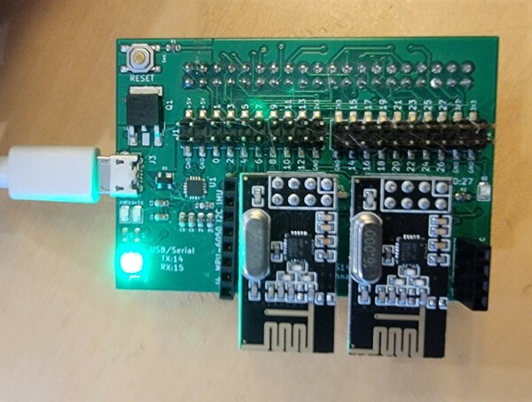
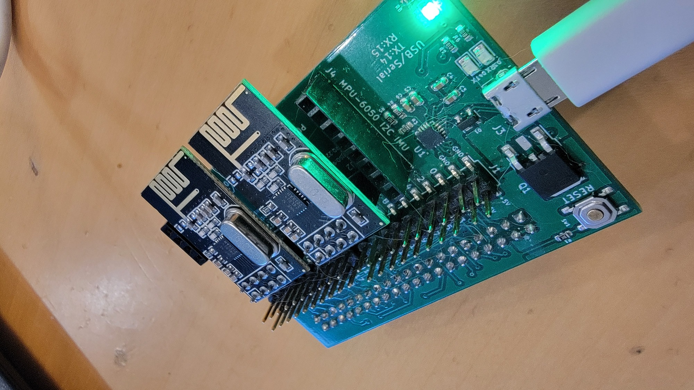
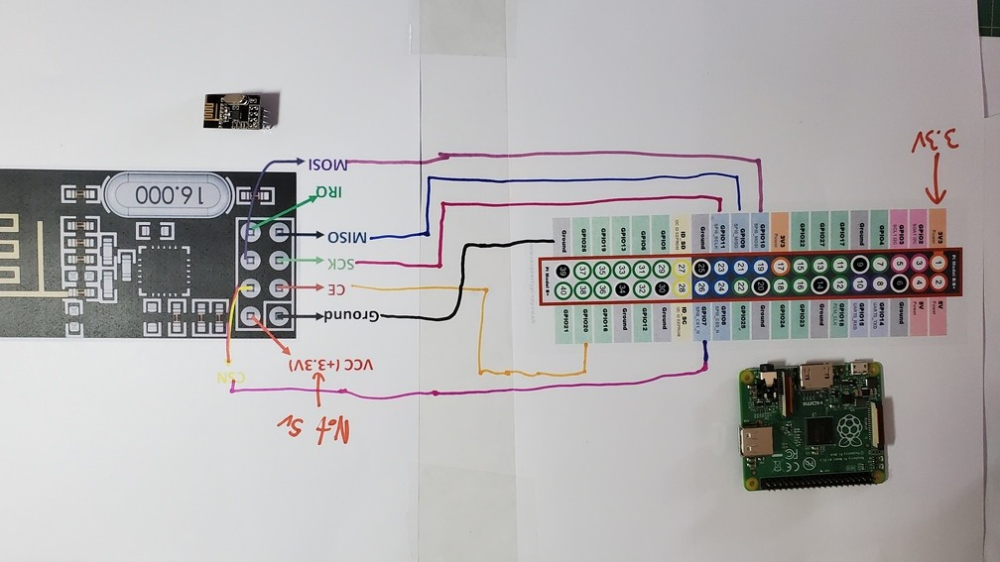
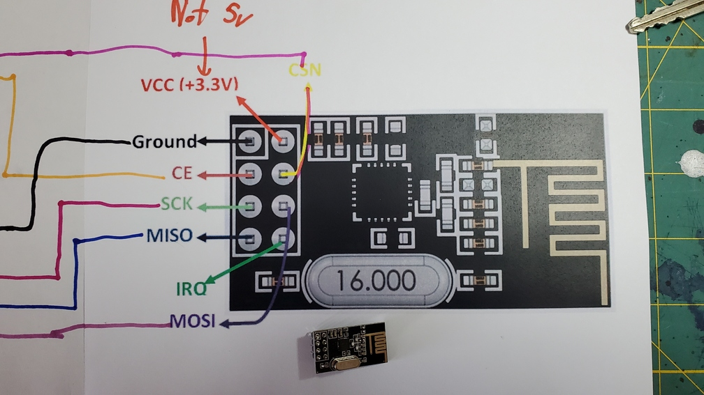
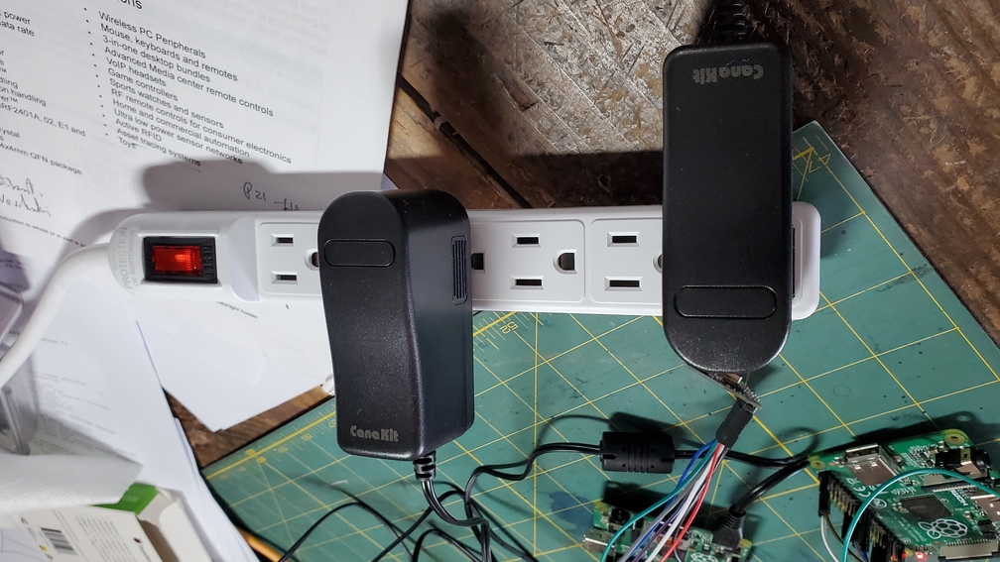
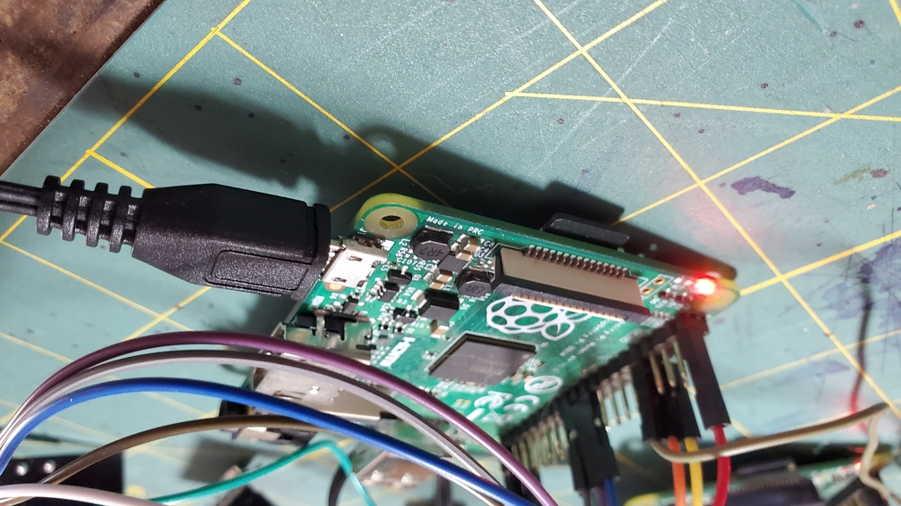

## Prelab for nrf24l01p

Make sure you start on the datasheet early and make sure your hardware device
runs before lab!

---------------------------------------------------------------------
#### Quick check.

  

  

Today:
  - plug in your two NRF devices.
  - do `make` in the `staff-binaries` directory: a bunch of stuff should run,
    and you should see sendig and receivig messages.

---------------------------------------------------------------------
### Readings

The NRF datasheet:

  - `docs/nRF24L01P_PS_v1.0.annot.pdf` is an annotated copy of the 
     NRF datasheet.  It's big, so read carefully.   We can skip a bunch
     of it, but the parts we care about we really care about.
  - [CHEATSHEET](CHEATSHEET.md) gives a cheat-sheet of page numbers to 
    crucial parts as well as saying what to concentrate on.

SPI: The NRF communicates using the serial peripheral interface (SPI)
protocol.  This is common on cheap devices, but has the downside that
it needs a lot of wires.  If you're curious about how it works:

   -  [The wiki SPI protocol page](https://en.wikipedia.org/wiki/Serial_Peripheral_Interface) is reasonable.

   - Chapter 10 (starting at page 148) of the Broadcom documents describes
     the hardware support.

We give you a driver (`staff-objs/spi.o`), but feel free to write your
own!  It's a fun project.  As with the UART, it's not hard to bit-bang
your own version.  From the wiki:

            /*
             * Simultaneously transmit and receive a byte on the SPI.
             *
             * Polarity and phase are assumed to be both 0, i.e.:
             *   - input data is captured on rising edge of SCLK.
             *   - output data is propagated on falling edge of SCLK.
             *
             * Returns the received byte.
             */
            uint8_t SPI_transfer_byte(uint8_t byte_out) {
                uint8_t byte_in = 0;
                uint8_t bit;
                
                for (bit = 0x80; bit; bit >>= 1) {
                    /* Shift-out a bit to the MOSI line */
                    write_MOSI((byte_out & bit) ? HIGH : LOW);
                
                    /* Delay for at least the peer's setup time */
                    delay(SPI_SCLK_LOW_TIME);
                
                    /* Pull the clock line high */
                    write_SCLK(HIGH);
                
                    /* Shift-in a bit from the MISO line */
                    if (read_MISO() == HIGH)
                        byte_in |= bit;
                
                    /* Delay for at least the peer's hold time */
                    delay(SPI_SCLK_HIGH_TIME);
                
                    /* Pull the clock line low */
                    write_SCLK(LOW);
                }
                return byte_in;
            }

---------------------------------------------------------------------
### Hardware hookup

***NOTE: if you are using Parthiv's breakout board, then you don't have to 
 worry about wiring hookup instructions.***

As mentioned above, because the NRF uses SPI, there's a lot of wires.
It actually adds a couple of extra ones.  You want to be very careful
hooking things up.  Just to make things annoying, there seems to
be a high manufacturing defect rate on these, and broken NRF can be
indistinguishable from a mis-wired one.

Below is the schematic for the pi and NRF.  Before you hook up anything
***make absolutely sure you only power the nrf using 3.3v***.   5v will
damage them (and in a bad way such that they might appear to mostly work,
rather than just fail completely).

Note: the below wiring diagrams are top-down views, even though the wires 
themselves connect to the bottom of the NRF chip.  You should be able to see 
the oscillator (the big oblong silver thing) and the antenna (the golden 
zig-zag on the edge) when looking down at the chip.

<table><tr><td>
  
</td></tr></table>
<table><tr><td>
  
</td></tr></table>

When you run `code/0-test-simple` it should print out a reasonable values.

    NRF:initial state:
    NRF:	CONFIG (1000):	PWR_UP=0, PRIM_RX=0, CRC=0 EN_CRC=1
    NRF:	EN_AA (111111):	NRF:all pipes have auto-ack enabled
    NRF:	EN_RXADDR (11):NRF:	pipes enabled:NRF: pipe0=1 NRF: pipe1=1 NRF:
    NRF:	SETUP_AW:	address=5 bytes
    NRF:	SETUP_RETR (=11):	retran delay=250usec, attempts=3
    NRF:	RF_CH(=10):	2.402Mhz
    NRF:	RF_SETUP(=1111):	bwidth = 2Mbs, power= 0dBm
    NRF:	STATUS(=1110): RX-int=0, TX-int=0, RT-int=0 RXpipe=111 (empty), TX-full=0
    NRF:	TX_ADDR = 0xe7e7e7e7e7
    NRF:	RX_ADDR_P0 = 0xe7e7e7e7e7
    NRF:	RX_PW_P0 (0): 0 byte fixed size packets
    NRF:	RX_ADDR_P1 = 0xc2c2c2c2c2
    NRF:	RX_PW_P1 (0): 0 byte fixed size packets
    NRF:	FIFO_STATUS(=10001): TX_FULL=0, TX_EMPTY=1, RX_FULL=0, RX_EMPTY=1

Again, **MAKE SURE YOU ONLY USE 3.3V** for the NRF chip.

A couple of things:
  1. You're going to need two pi's running at the same time, just like
     the sw-uart lab.   So refresh your memory on how to bootload two
     pi's on your laptop.  

  2. If you're ambitious you could rewrite your `my-install` to handle
     multiple binaries and output.  This will make a major difference in
     ease-of-use.

  3. The nrf will stay up even if you reboot the pi --- so to hard reset
     it you will need to unplug and then plug in your pi.  This is obviously
     a big hassle, especially if your OS sometimes redoes the device bindings.

     As an improvement, if you have two microUSB power supplies I
     highly recommend redoing the power setup as follows.  For both
     pi's, disconnect the tty-usb power from them, and instead connect
     a microUSB power adapter to each pi.   Plug both adapters into a
     power switch you can quickly turn them off/on, thereby preserving
     your OS's ttyUSB device connection.  Reset then just takes a flip
     of a switch.  Photos below.

<table><tr><td>
  
</td></tr></table>
<table><tr><td>
  
</td></tr></table>
