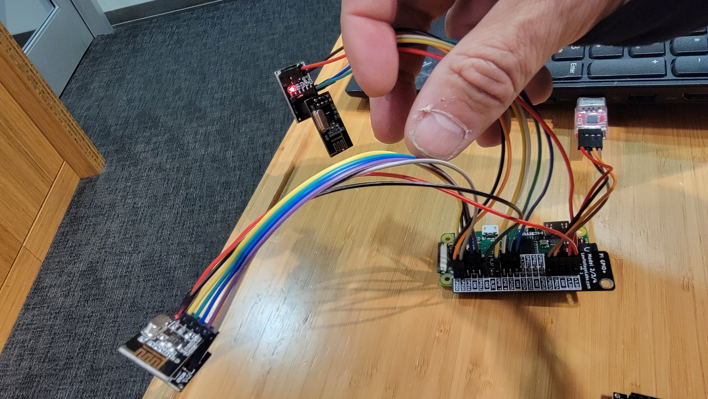

## Build a bi-directional network stack with nrf24l01p chips

***NOTE: this will undergo massive surgery, but you can read to get a rough
feel for what we will be doing.***

***NOTE: Make sure you start with the [PRELAB](PRELAB.md)!***

How to navigate:
  - `nrf-config.h`: this has the `nrf_config` structure and a bunch of santity checking
    for the different options (data rate, retransmission attempts, channel frequency, etc).
  - `nrf-internal.h`: contains the register definitions for the device and a bunch of helpers to
    get useful information (e.g., is the RX or TX message FIFO full or empty, get and 
    clear different interrupts, etc).
  - `nrf-internal.c`: has `nrf_dump` and the different routines to that use SPI to
    communicate with the device.  You should definitely look over `nrf_dump` to see
    how to read the different values.  You will use it to check that your `nrf_init`
    is correct.
  - `nrf-public.c`: this has the routines that call your driver.  It is currently
    setup to call our versions (with the `staff_*` prefix) --- you will just go
    through and implement these yourself one at a time and swap to using yours.

--------------------------------------------------------------------------------
#### Part 0: hooking up the hardware.
  

##### Basic test

There are two tests for hardware in `staff-binaries`:
  - `0-no-ack-hw-check.bin`: runs and prints the values for the NRF setup for one
    no-ack'd pipe.
  - `0-ack-hw-check.bin`: runs and prints the values for the NRF setup for one
    ack'd pipe.

  
  

You should hook up your NRF as follows:

For the "server" we use the hardware SPI pins (though our implementation is
software):
  - "CE" on the NRF is hooked up to GPIO 21.
  - MOSI: GPIO 10.
  - MISO: GPIO 9.
  - CLK: GPIO 11.
  - CSN: hooked up (confusingly) to CE1 (GPIO 7).
  - Hook up power and ground.  B/c we have voltage regulators you can use 5v.

For the "client":
  - "CE" on the NRF is hooked up to GPIO 20.
  - MISO: GPIO 26.
  - MOSI: GPIO 19.
  - CLK: GPIO 13.
  - CSN: hooked up to GPIO 6.
  - Hook up power and ground.  B/c we have voltage regulators you can use 5v.

There are a lot of wires!
  1. Hook up your first NRF to the server pins.  It should print a configuration.
     If we have enough volatage adapters use one, since they make it a bit easier.

  2. Hook up your second NRF to the client pins.  Now both binaries
     should run and print configurations.

##### Power test

We've had issues with dirty power (it seems primarily out of macbooks)
--- this will allow you to send, but mess up receive.

  0. Add `sw-spi.o` to `STAFF_OBJS` in `libpi/Makefile`.  (This is the
     software spi implementation.)
  1. Compile the code in `code` and make sure the two tests (above) pass by 
     doing `make check`.
  2. Change the `MY_NRF_CHANNEL` channel value in `nrf-test.h` to the value
     you got in class.
  3. Change the Makefile to run the two one way tests (prefixed with
     `1-*`: there's a comment).
  4. ***CRUCIAL***: do `make run` not `make check` since if packets get dropped
     the out files won't match.
  5. If these pass: GREAT!!!   I'm happy.  

     If they do not, then come see us.  It *could* be b/c your channel
     is getting interference in which case we need to try some other
     channels.  Or it could be b/c of dirty power.  To check this problem
     we will run a staff hardware setup that uses power regulators to
     clean up the power.

--------------------------------------------------------------------------------
#### Part 1: Implement `nrf_init`.

This is the longest part, since you need to set all the regsiters,
but it's also probably the most superficial, in that you can just
use `nrf_dump` to get our hardware configuration and then walk down,
replicating it.

It can get setup either for acknowledgements (`ack_p=1`) or no
acknwledgements (`ack_p=0`) but not both.
   0. `ack_p=0`: for this you only have to enable pipe 1.  No other pipe should be
      enabled.  This is used by the first test `1-one-way-no-ack.c` which sends bytes with
      no retransmissions from a server to a client.

   1. `ack_p=1`: for this you will have to enable both pipe 0 and pipe 1.
      This is used by a test `1-one-way-ack.c` which sends a 4 byte
      value back and forth between the client and the server.

You'll want to make sure that the output after running each test program
matches up.

When you swap in your `nrf_init`, both tests should work.

--------------------------------------------------------------------------------
#### Part 2: Implement `nrf-driver.c:nrf_tx_send_noack`.

You'll implement sending without acknowledgements.
   1. Set the device to TX mode.
   2. Set the TX address.
   3. Use `nrf_putn` and `NRF_W_TX_PAYLOAD` to write the message to the device
   4. Pulse the `CE` pin.
   5. Wait until the TX fifo is empty.
   6. Clear the TX interrupt.
   7. When you are done, don't forget to set the device back in RX mode.

When you change `nrf_send_noack` to call your `nrf_tx_send_noack` the first test
should still work.

--------------------------------------------------------------------------------
#### Part 3: Implement `nrf-driver.c:nrf_get_pkts`.

For this part, you'll just spin until the RX fifo is empty, pulling
packets off the RX fifo and pushing them onto their associated pipe.
For today, we're only using a single pipe (pipe 1) so you should assert
all packets are for it (you can use `nrf_rx_get_pipeid` for this).  For
each packet you get, the code will push it onto the pipe's circular queue
(just as we did in previous labs).  You should clear the RX interrupt.
When the RX fifo is empty, return the byte count.

When you swap in `nrf_get_pkts` in `nrf-public/nrf_pipe_nbytes` both of
the tests should still work.

--------------------------------------------------------------------------------
#### Part 4: Implement `nrf-driver.c:nrf_tx_send_ack`.

You'll implement sending with acknowledgements.  It will look similar to 
the no-ack version, except:
   1. You need to set the P0 pipe to the same address you are sending to (for acks).
   2. You need to check success using the TX interrupt (and clear it).
   3. You need to check for failure using the max retransmission interrupt (and clear it).
   4. When you are done, don't forget to set the device back in RX mode.

The second test should still work when you swap in.

Congratulations!  You now have a very useful networking system.

--------------------------------------------------------------------------------
#### Extensions

##### Use interrupts

The main one I'd suggest:  change it to use interrupts!  This should
not take that long.

  1. Connect the NRF interrupt pin to a free GPIO pin.
  2. Grab the code from the GPIO interrupt lab.  and steal the initialization and 
     interrupt handler code.
  3. Should hopefully just take 20 minutes or so.
 
##### Implement your own software SPI

I just used the SPI code in the wikipedia page; worked first try.
Make sure you set the pins to input or output.   Also, make sure you
are setting the chip select pin high and low as needed.

##### Remote put32/get32

Do a remote put32/get32:
  1. You can write a small piece of code that waits for PUT32 and GET32 messages and
     performs them locally.
  2. This lets remote pi's control it.
  3. Should be pretty easy to make a small shim library that can run your old programs
     remotely.

##### Other stuff
  
Many many extensions:
  0. Do a network bootloader.
  1. Use more pipes.
  2. See how fast you can go
  3. Change the interface to make it easy to change the different messages sizes.
