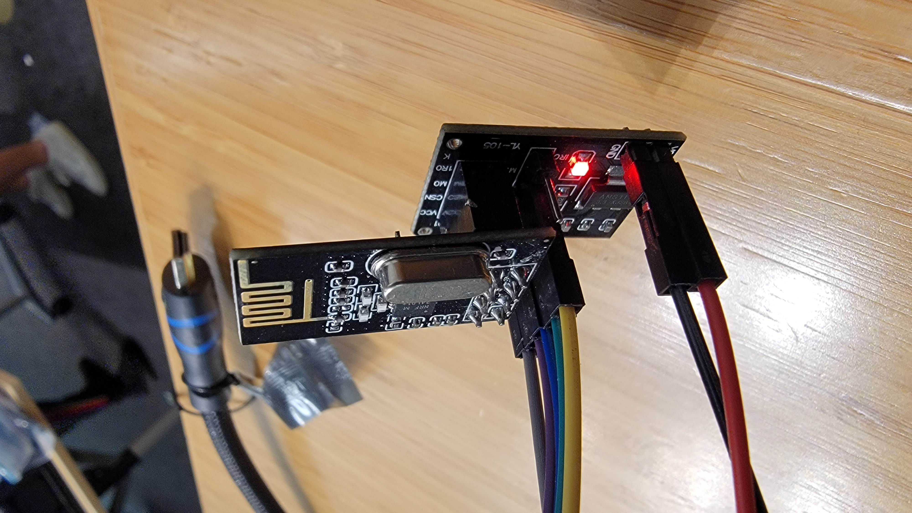

## Get two nrf24l01p RF tranceivers to talk to each other.

  

Today you'll build some code to make the NRF chips we have talk to
each other.   The lab is organized as a fetch-quest where you'll build
the routines to (1) initialize, (2) receive, (3) send non-acked packets,
(4) send acked packets.  This gives you a simple starting point for
networking.  

  - Make sure you go through the [CHEATSHEET](./CHEATSHEET-nrf24l01p.md).
    A bunch of facts you need are there, so it's a good cheatcode.

The code is currently setup so that all the tests *should* pass if you
just run `make check`.
   - ***NOTE: with 50+ people in one room we will have signficant
     RF interference***
   - So: if the tests don't pass, this doesn't mean the code is broken.
     It may just mean you are getting interference.
   - if you look in `nrf-default-values.h` there are different addresses
     you can try (you can use others too).  Worth plugging them in 
     to see if reduces issues.  You can also use a different channel.

  
  

Parthiv's board makes this much easier than in the past.  On the other
hand the size of the datasheet makes it not that easy.  As a result,
we have way more starter code than usual.
If you are doing this *without* Parthiv's board and need to wire things
up with jumpers, the 2022 NRF lab has some discussion 
on [how to do this](https://github.com/dddrrreee/cs140e-22win/tree/main/labs/17-nrf24l01p).

What you will change:
  - `nrf-driver.c`: all the code you write will be in here.
  - `nrf-default-values.h`: different default values for the NRF.  You 
    can change these.

What you should not have to change:
  
  - `nrf-public.c`: helpers that wrap up the NRF driver interface for
    clients to send and receive.  These are the routines that will call
    your call your driver.
  - `nrf-hw-support.c` and `nrf-hw-support.h`: a bunch of support for
    reading and writing the NRF over SPI.
  - `nrf-test.h`: helpers for testing.  Useful to look at to see how
    to use the NRF interfaces.
  - `tests/*.c`: tests.  Useful to look at to see how
    to use the NRF interfaces.

#### Checkoff

Pretty simple:
  1.  You should have implemented your own copies of the `staff_` routines
      and removed `staff-nrf-driver.o` from the makefile.
  2. `make check` should pass.

Extension:
  - You can always do this lab on hard mode and build your own from scratch:
     you'll learn alot.  The tests give reasonable iterfaces.

--------------------------------------------------------------------------------
### Part 1: Implement `nrf-driver.c:nrf_init`.

This is the longest part, since you need to set all the regsiters,
but it's also probably the most superficial, in that you can just
use `nrf_dump` to get our hardware configuration and then walk down,
replicating it.

As mentioned above, for simplicity, you'll only configure the NRF to use
a single pipe.  This pipe can either be initialized for acknowledgements
(`ack_p=1`) and or no acknwledgements (`ack_p=0`) but not both.

   -  `ack_p=0`: for this you only have to enable pipe 1.
      No other pipe should be enabled.  

   - `ack_p=1`: for this you will have to enable both pipe 0 and pipe 1.
      This is used by a test `1-one-way-ack.c` which sends a 4 byte
      value back and forth between the client and the server.

   - After you implement these and swap in your `nrf_init`, all the
     tests should still pass.  (We discuss common bugs and what they
     look like at the end of Part 1.)

Cheat code:
   - If you get stuck you can use `nrf_dump` to print the values we set
     the device too and make sure you set them to the same thing.
     It should be the case that if you change default values that both
     still agree!

#### Two key helpers: use these.

When setting up values, use the following two routines
(provided in `nrf-hw-support.c`):

  1. When setting values, almost always use the following routine:

            nrf_put8_chk(n, NRF_RX_PW_P1, c.nbytes);

     That will automatically read back the value after writing it and
     `panic` if it differs.  You should use it for almost all standard
     registers (note the `NRF_STATUS` will act differently: why?)

     In general, when implementing device code for an unknown device: if
     you write a value to a register that you believe should not change,
     read the value back and check it.  This will detect several errors,
     First, if the register discards values in ways you didn't expect.
     Two, it is smaller than expected or you misunderstood the helper
     routines (this happened when people set the multi-byte address using
     `put8` routines which just write a single byte).  Or, finally,
     if one of your NRF devices is dead (or the SPI is misconfigured).

  2. The receive and transmit addresses are multi-byte.  They can't
     be written with a simple `nrf_put8` (which just writes 1 byte).
     You can use `nrf_set_addr` to set the address:

            nrf_set_addr(n, NRF_RX_ADDR_P1, rxaddr, addr_nbytes);

     You should use it and look at its implementation to see
     how it works.  (For any new SPI device you'd likely have to 
     figure out something similar!)

#### Key points: read this before coding.

Some advice:

  0. Before you start reading and writing the NRF you need to setup the 
     structure:

            nrf_t *nrf_init(...) {
                nrf_t *n = kmalloc(sizeof *n);
                n->config = c;
                nrf_stat_start(n);
                n->spi = pin_init(c.ce_pin, c.spi_chip);
                n->rxaddr = rxaddr;
                cq_init(&n->recvq, 1);

  1. You need to setup GPIO and SPI first or nothing will work (see the
     code above: `pin_init`).
  2. You must put the chip in "power down" mode before you change
     the configure.
  3. If in not-ack mode,  just enable pipe 1.
  4. If in ack mode,  you have to enable both pipe 0 and pipe 1.
     Pipe 0 is needed to receive acks.  

  5. You should flush the RX (`nrf_rx_flush()`) and TX fifos
     (`nrf_tx_flush()`) before putting the chip in "power up" mode.
     For today they should also be empty:

            assert(!nrf_tx_fifo_full(n));
            assert(nrf_tx_fifo_empty(n));
            assert(!nrf_rx_fifo_full(n));
            assert(nrf_rx_fifo_empty(n));
        
            assert(!nrf_has_rx_intr(n));
            assert(!nrf_has_tx_intr(n));
            assert(pipeid_empty(nrf_rx_get_pipeid(n)));
            assert(!nrf_rx_has_packet(n));

  6.  We don't use dynamic payload or feature stuff today:

            // dynamic payload
            nrf_put8_chk(n, NRF_DYNPD, 0);
            // feature register.
            nrf_put8_chk(n, NRF_FEATURE, 0);

  7. After write 1 to the "power up" bit in `NRF_CONFIG`, you should
     (as is common for complex devices) wait "long enough" for the
     device to set itself up.  In this case, delay 2 milliseconds
     (`delay_ms(2)`).

  8. Finally, put the NRF in "RX mode".  The enum `rx_config` has the
     bits set the way we need them.  Note: don't ignore the CE pin!

  9. In general add tons of asserts to verify that things are in the
     state you expect.

#### Two common bugs

The most common bug from class: Not correctly putting the NRF into 
RX mode:

  - The result: the NRF values in the 0 tests would match, but 
    the NRF would not receive messages in the later tests.

  - This issue extended later to messing up the general
    transition between RX mode and TX mode.

  - If you look at the state machine on page 20, you can see that we
    can move between RX mode and TX mode in the same way: (1) write
    CE=0 (to get to `Standby-I` state) (2) set `NRF_CONFIG` to either
    `rx_config` or `tx_config` as appropriate, and finally (3) set CE=1.

    Thus, RX mode: `CE=1` and `NRF_CONFIG=rx_config`.
    TX mode: `CE=1` and `NRF_CONFIG=tx_config`.

  - Your code will go back and forth between RX mode and TX modes
    in multiple places. After all the debugging in the lab, I strongly
    suggest you write two routines (e.g., `nrf_tx_mode` and `nrf_rx_mode`)
    so you can write this code once, get it right, and then forget
    about it.

  - Recall from the cheatsheet: when the NRF is not in RX mode it will
    blithely ignore all packets sent to it.  Thus, we are always in RX
    mode other than a brief flip to TX to send a packet.  

  - In summary from above: at the end of `nrf_init`, we should be
    in RX mode and thus from these previous values: with `CE=1` and
    `NRF_CONFIG=rx_config`.)

Second most common bug: in `nrf_init` hardcoding variables as constants.

  - This is partly on me: a nasty bug people hit was caused by
    hard-coding NRF initialization values rather than setting 
    them based on input.  

    Common result: the `0` tests and 4-byte message tests passed, but
    the 32-byte message tests would fail (since the NRF was hard-coded
    for 4-bytes).  Similarly, hard-coding the NRF receive address which
    meant it wouldn't receive anything if the address changed.

  - You should be setting the NRF's receive address using `rxaddr` and
    its message message size using the `nbytes` in the `config` structure.

    In general, all the values in the `nrf-default-values.h` should be 
    used during setup.  Don't hard-code.

--------------------------------------------------------------------------------
### Part 2: Implement `nrf-driver.c:nrf_tx_send_noack`.

You'll implement sending without acknowledgements.  For a rough reference
(for ack'd packets), look at Appendix A (page 75): "Enhanced ShockBurst
transmitting payload".

Roughly:
  1. Set the TX address:

            nrf_set_addr(n, NRF_TX_ADDR, txaddr, addr_nbytes);

  2. Write the message to the device using `nrf_putn` with the NRF
     command `NRF_W_TX_PAYLOAD`:

            nrf_putn(n, NRF_W_TX_PAYLOAD, msg, nbytes);

     At this point "the TX fifo is not empty" as per the state machine.

  3. We should be in RX mode.  So to transmit the packet, first go
     to Standby-I by setting `CE=0` (see state machine).  Then, start
     the transmit by (1) setting `NRF_CONFIG=tx_config` and then (2)
     `CE=1`.  This will take us to TX mode.

  4. Detect when the transmission is complete by either (1) waiting
     until the TX fifo is empty or (2) for the TX interrupt to be
     triggered.  I *believe* the methods are equivalent.  The latter
     (interrupts) is similar to sending with acks so probably makes
     more sense.

  5. Clear the TX interrupt.
  6. Transition back to RX mode.
  7. Return the numbe of bytes sent (just `nbytes` that the routine
     was called with).
  8. When you get rid of the call to our `staff_nrf_tx_send_noack` the
     tests should work.

--------------------------------------------------------------------------------
### Part 3: Implement `nrf-driver.c:nrf_get_pkts`.

The basic idea: pull packets off the RX fifo until there are none, and
push the data into single NRF receive queue `recvq`, and return the count.
For a reference, see the receive steps on Page 76, Appendix A, "Enhanced
ShockBurst receive payload".

Roughly:
  1. While the RX fifo is not empty (`!nrf_rx_fifo_empty(n)`)
     loop pulling packets.

  2. Get the pipeid for the incoming packet using the 
     status field (page 59) or the helper `nrf_rx_get_pipeid(n)`.
     Today, it should always be for
     pipe 1.  You should panic if not.

  3. Read in the packet using `nrf_getn`:

            nrf_getn(n, NRF_R_RX_PAYLOAD, buf, n->config.nbytes);

     and push it onto the `recvq`:   

            if(!cq_push_n(&n->recvq, msg, nbytes))
                panic("not enough space in receive queue\n");

  4. Clear the RX interrupt.
  5. Return the count of packets read.
  6. When you remove the call to our `staff_nrf_get_pkts` the 
     tests should still work.

#### Most common bug

The most common mistake I saw was reading incoming messages (step 3)
into a too-small temporary buffer message.  Packets can be up-to 32
bytes, so the size of the temporary buffer you read packets into (`buf`)
should be 32-bytes.  Multiple people read the packets into a `uint32_t`
temporary, which would work great for 4-byte packets (same size) but
corrupt the stack in weird ways if larger.  If you have weird corruption
issues, it is probably from this mistake.

--------------------------------------------------------------------------------
### Part 4: Implement `nrf-driver.c:nrf_tx_send_ack`.

You'll implement sending with acknowledgements.  It will look similar to 
the no-ack version, except:

 1. You need to set the P0 pipe to the same address you are sending 
    to (for acks).

        nrf_set_addr(n, NRF_RX_ADDR_P0, txaddr, addr_nbytes);

 2. You need to check success using the TX interrupt (and clear it).

 3. You need to check for the max retransmission interrupt
    (there is a helper `nrf_has_max_rt_intr(n)`),
    which the hardware sets when it has not received an ACK 
    after re-sendig the packet the maximum number of times configured
    by `nrf_init`.

    For today, just panic if this occurs (it should not except in the
    case of extreme interference).  For an extension below, you could
    then do a randomized exponential backoff and retry.

 4. When you are done, don't forget to set the device back in RX mode.
 5. Return the numbe of bytes sent (just `nbytes` that the routine
    was called with).

When you get rid of the call to our `staff_nrf_tx_send_ack` the tests
should work.  If the ack-tests break, make sure you've enabled pipe 0
since the hardware uses that to receive acknowledgements.

--------------------------------------------------------------------------------
### Part 5: write a test to send to your partner.

Rewrite the ping-pong test so you can send and receive to your partner.
Their RX address should be the TX address you send to and vice-versa.

Congratulations!  You now have a very useful networking system.

  

--------------------------------------------------------------------------------
### Extensions

There's a ton of extensions.  Building out most of these would 
be a great, useful final project:
  1. Speed!  The code is slow.  You should be able to tune it.
     One easy change is to change it so it can send multiple
     packets at a time.
  2. Make a reliable FIFO.
  3. Do a network bootloader.
  4. Do exponential backoff to handle the case where two nodes blast
     each other .
  5. Do a tiny little distributed system!
  6. Replace our SPI with a bit-banged version (this is about 15 lines,
     you can take right from the wiki-page for SPI).
  7.  Use more pipes.
  8. Send and receive using both NRFs to double the effective bandwidth.
     A great final project is seeing how many NRFs you can drive at once.

#### Use interrupts

A very illuminating modification is to change the code to 
use interrupts!  This will allow you to make it much faster.

  1. Connect the NRF interrupt pin to a free GPIO pin.
  2. Grab the code from the GPIO interrupt lab.  and steal the initialization and 
     interrupt handler code.
  3. Should hopefully just take 20 minutes or so.
 
#### Implement your own software SPI

I just used the SPI code in the wikipedia page; worked first try.
If you do this make sure:
  - You set the SPI pins to input or output correctly.
  - Use the same pins that hardware SPI will use. 
  - That you are setting the chip select pin high and low as needed.
  - That you aren't sending data too quickly (the NRF's are actually
    pretty slow).  I would start slow and speed up until it breaks.

#### Remote put32/get32

Do a remote put32/get32:
  1. You can write a small piece of code that waits for PUT32 and GET32 messages and
     performs them locally.
  2. This lets remote pi's control it.
  3. Should be pretty easy to make a small shim library that can run your old programs
     remotely.
