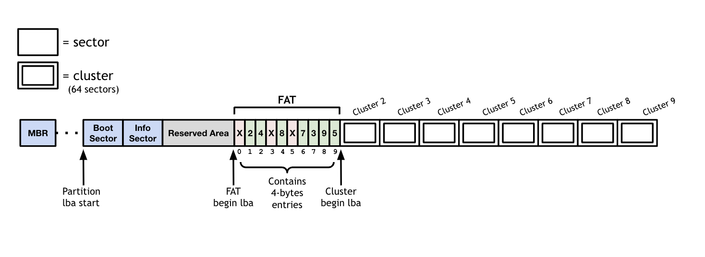

## FAT 32.

#### Introduction
In this lab, you implement a FAT32 file system. FAT32, which stands for File 
Allocation Table-32, is a disk format used to organize the files stored on a 
disk drive. The disk drive is marked up into addressable chunks called sectors 
and a “File Allocation Table” or FAT is created at the start of the drive so 
that each piece of information in the file can be found on the computer. The 
“32” part of the name refers to the amount of bits that the filing system uses 
to store these addresses and was added mainly to distinguish it from its 
predecessor, which was called FAT16. 

Below is a digaram of what the FAT-32 file system might look like when its 
laid out on the disk: 

<table><tr><td>
  
</td></tr></table>

#### Structure

One helpful note to better understand the FAT32 file system is to consider
its structure. The FAT32 system consists of 3 separate regions. 

##### Reserved Sectors
The first region is called the "Reserved Sectors" region. In our diagram 
above, this region refers to the blue sectors as well as the grey area
labeled "Reserved Area". The first reserved sector (logical sector 0) is 
the Boot Sector. It includes basic file system information and usually 
contains the operating system's boot loader code.

##### FAT Region
The second region is called the FAT Region. This region is where the File
Allocation Table is stored. In our diagram, this region is labelled with the
section "FAT" and starts with the FAT Begin Logical Block Address (LBA) and 
ends with with the Cluster Begin Logical Block Address (LBA).

##### Data Region
The last region is the Data Region. This is where the actual file and directory 
data is stored. This region takes up most of the partition. The size of files 
and subdirectories can be increased arbitrarily (as long as there are free clusters) 
by simply adding more links to the file's chain in the FAT. Files are allocated 
in units of clusters, so if a 1 KB file resides in a 32 KB cluster, 31 KB are wasted.

