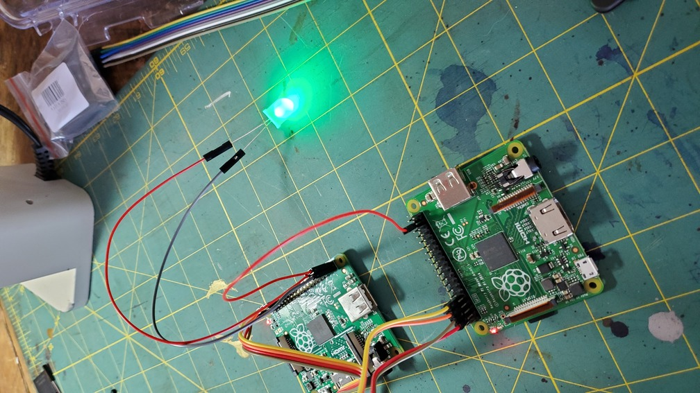
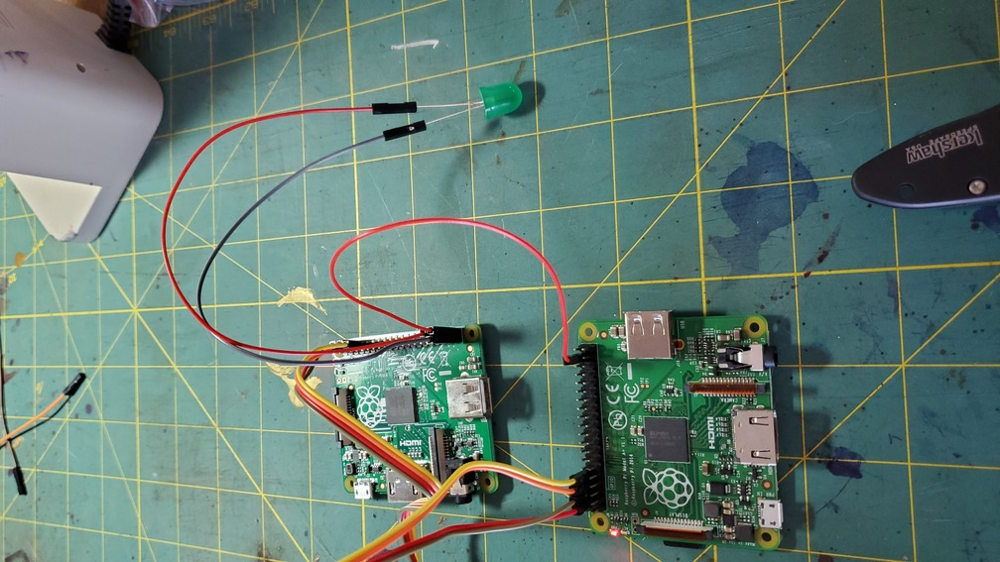
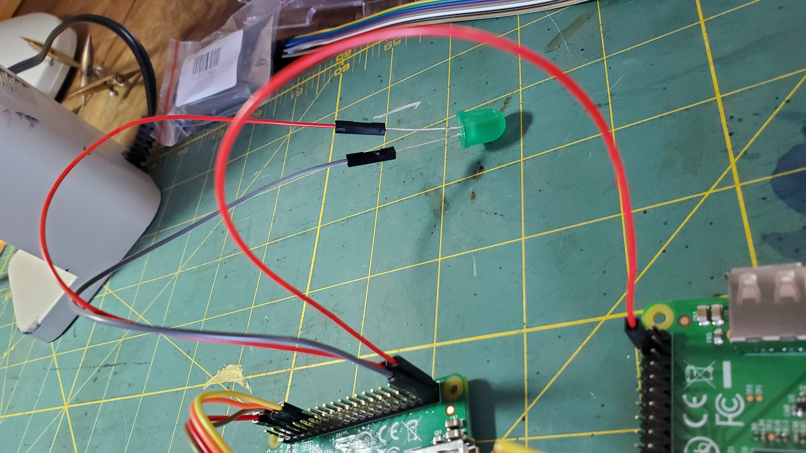

# Extensions

## Extension: Implement `gpio_set_pullup` and `gpio_set_pulldown`

These are described in the [main readme](README.md). This is only an extension
if you haven't done baremetal Pi stuff before.

## Extension: Forward one pi signal to another.

We now do a cool trick: transparently forward signals from one pi to
another. While mechanically trivial, this is a "hello world" version of
some deep topics.

**_BEFORE YOU DO ANYTHING_**:

- **_MAKE SURE YOU SHARE GROUND BETWEEN YOUR AND PARTNER'S TWO PI's_**
- If you do not have a jump between them connecting ground pins,
  you can fry a pi or worse.
- Note: if you are using two pi's on a single laptop, you can
  get away without sharing ground since they both do so implicitly
  though the laptop.

What to do:

1.  Hook up pin 20 from one pi (call this pi-1) to pin 21 of the other
    (pi-2).

2.  Plug pi-2 in and run `3-input.bin` input program.

    % pi-install /dev/ttyUSB0 code/3-input.bin

3.  Plug pi-1 in and run `1-blink.bin` program.

    % pi-install /dev/ttyUSB1 code/1-blink.bin

4.  Success looks like:

  
  
  

This doesn't seem like much, but is shows the glimmer of several deeper
tricks:

1.  It shows how you can take code written with very strong assumptions
    and --- without any software changes --- dramatically change
    its behavior, correctly. In this case we take a system that
    assumed it running locally, controlling its own device and made
    it transparently control a remote device (or even many).

    Among other examples this trick (on a much grander scale) is similar
    in spirit to how virtual machines such as VMWare work.

2.  You can view this single wire as a very primitive network or bus.
    On = sending a 1 bit. Off = sending a 0. And, if we can send 0
    and 1 we can send anything.

    With some simple changes (we will do these in later labs) you
    can use this method to send general-pupose messages between pi's.
    And if you add a second wire, you easily can do so with incredibly
    low-latency: almost certainly lower than between two full-fledged
    Unix servers. (One of many examples where we will be able to write
    custom, clean, simple code that is far faster or more powerful
    than a full-fledged "real" system.)

---

## Extension: write the smallest blink or input in assembly code

This is a fun puzzle: write versions of `1-blink.c` and/or `3-input.c`
as a single assembly file (`.S`) with as few instructions as possible.

You can either write the code from scratch (hard mode) or compile
everything to assembly (`gcc -S`), look at the result and start
tweaking it.

This will give you a much stronger view of assembly.

---

## Medium Extension: Implement the HC-SR04 sonar device.

We have about 10 HC-SR04 devices, which use sonar to measure distance.
At a high level it sends a For this extension you'll going to implement
and a distance measuring device that uses sonar using the HC-SR04 device.
At a high level it sends a high frequency pulse (if you have a cat, it may
get annoyed) and tells you when/if it receives it back. You use the time
between pulse and receive to compute distance using the speed of sound.

You can use the lab writeup from a previous class:

- [sonar](https://github.com/dddrrreee/cs49n-21aut/tree/main/labs/3-sonar)

Note:

- If you need access to the writeup, we can add you to the repo.
- You will need a `libpi` and a few other things so you have `printk`.
  We can get you this.

---

## Major Extension: reverse engineer machine code

Generating machine code is fun, kind of sleazy, and most people have
no idea how to do it. It really gives you a feel for how the machine
actually operates.

For this extension:

- Read the [240lx lab](https://github.com/dddrrreee/cs240lx-22spr/tree/main/labs/1-dynamic-code-gen)
  where we reverse engineered machine encodings by feeding assembly to
  the assembler, getting the resultant machine code, and doing linear
  equation solving.

This is a fun lab, but it will likely take an afternoon.

---

## Extension: Break and tweak stuff.

If you finish, the are a bunch of ways you can "kick the tires" on your
system to understand better what is going on.

1.  Change the delay in the blink code to increasingly smaller amounts.
    What is going on?

2.  Add the reboot code below (we'll go into what different things mean)
    so that you don't have to unplug, plug your rpi each time:

         // define: dummy to immediately return and PUT32 as above.
         void reboot(void) {
              const int PM_RSTC = 0x2010001c;
              const int PM_WDOG = 0x20100024;
              const int PM_PASSWORD = 0x5a000000;
              const int PM_RSTC_WRCFG_FULL_RESET = 0x00000020;
              int i;
              for(i = 0; i < 100000; i++)
                   nop();
              PUT32(PM_WDOG, PM_PASSWORD | 1);
              PUT32(PM_RSTC, PM_PASSWORD | PM_RSTC_WRCFG_FULL_RESET);
              while(1);
         }

    Change your code to just loop for a small fixed number of times and make
    sure reboot() works.

3.  Force the blink loop to be at different code alignments mod 64.
    If you look at `1-blink.list` you can see the executable code and
    the addresses it is at. Do you notice any difference in timing?
    (You may have to make your delay longer.) What is going on?

---
