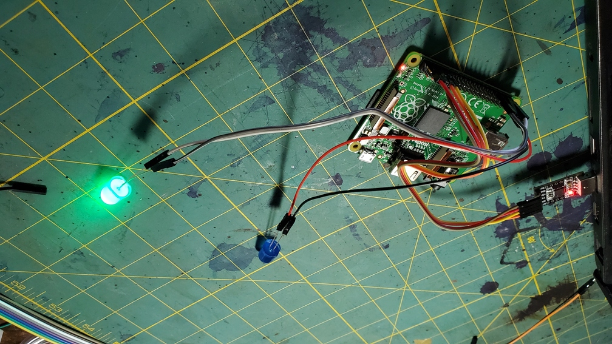
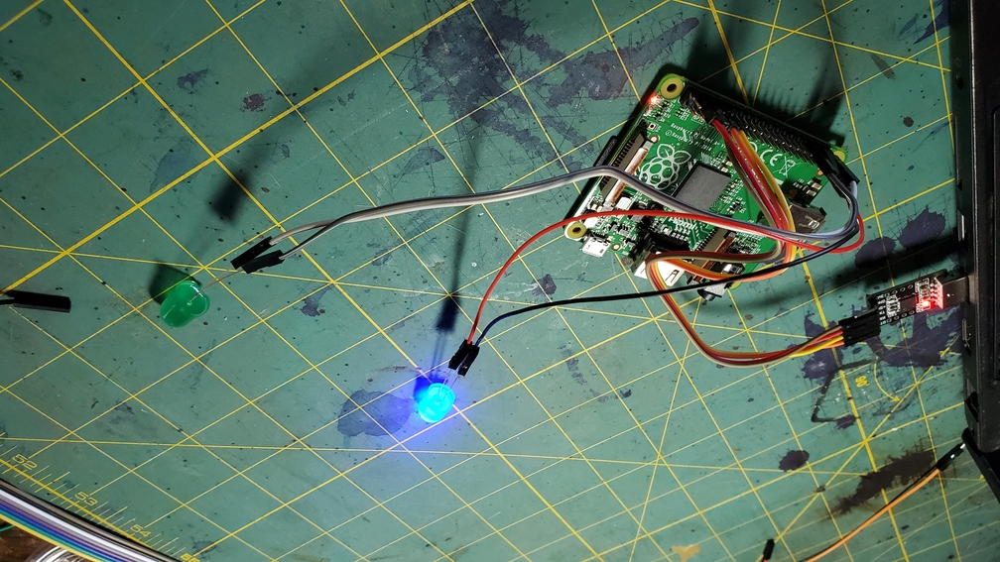
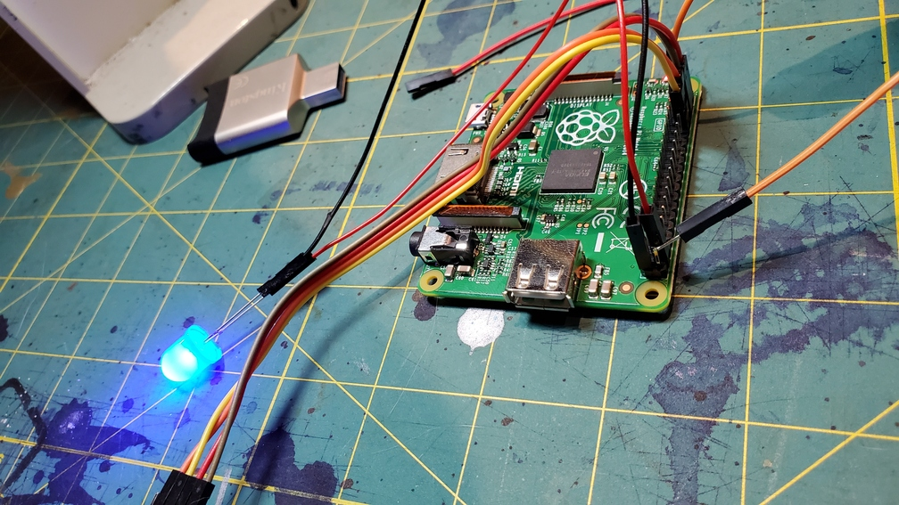
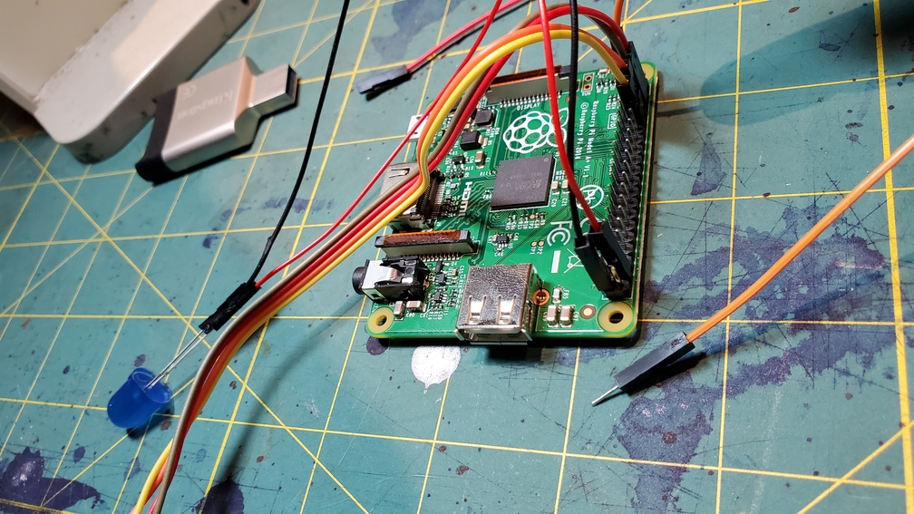

# Lab: write your own code to control the r/pi; throw ours out.

**Important: as always, read and complete the [PRELAB](PRELAB.md)
before lab!**

In this lab, you'll use the Broadcom document
(`../../docs/BCM2835-ARM-Peripherals.annot.PDF`) to figure out how to write the
code to turn the GPIO pins on/off yourself, as well as reading the pins to get
values produced by a digital device. You'll use this code to blink an LED and
to detect when a capacitive touch sensor is touched.

Make sure you read the [GPIO](GPIO.md) and [DEVICE](DEVICES.md)
notes.

See the [checkoff doc](CHECKOFF.md) for info on what you need to show to get
credit for the lab.

If this is your first time doing this stuff (i.e., you didn't take 107e), you
only need to do parts 1 and 2 of the lab (although you're welcome to do 3 if
you want to, of course).

## Setup (45 minutes)

See [the setup folder](setup/README.md) for more info on how to set up your
Raspberry Pi.

## GPIO (45 minutes)

### Part 1: Make blink work. (30 minutes)

You'll implement the following routines in `code/gpio.c`:

1.  `gpio_set_output(pin)` which will set `pin` to an output pin. This should
    take only a few lines of code.
2.  `gpio_set_on(pin)` which will turn `pin` on. This should take one line of code.
3.  `gpio_set_off(pin)` which will turn `pin` off. This should take one line of code.
4.  After doing so, wire up an LED pin to pin 20, power-cycle
    the pi, and use the bootloader to load the code:

          # unplug the pi.
          # connect an LED to pin 20
          % cd code
          # do your edits
          % make
          % pi-install 1-blink.bin
          # the LED on pin 20 should be blinking.

5.  Make sure that `code/2-blink.c` also works:

           # unplug the pi
           # connect an LED to pin 21
           # plug back in to reset.
           % pi-install 2-blink.bin
           # the LEDs on pin 20 and pin 21 should be in opposite orders.

    Success looks like:

  
  

6.  Make a copy of `1-blink.c` (make sure it works with the makefile) and
    change it so that it uses pins on two different banks. Make sure it works
    as expected! You could also do more than 2 LEDs.

Hints: [hints doc](HINTS.md)

### Part 2: Make input work (10 minutes)

Part 1 you used GPIO for output, you'll extend your code to
handle input and use this to read input. At this point you have the
tools to control a surprising number of digital devices you can buy on
eBay, adafruit, sparkfun, alibaba, etc.

For this part you'll:

- Implement `gpio.c:gpio_set_input` and `gpio.c:gpio_read()`
- Use it with the TTP223B touch sensor we gave out in class.
  The datasheet is in `docs/TTP223B-data-sheet.pdf`.

More detail:

1.  Implement `gpio_set_input` --- it should just be a few lines of
    code, which will look very similar to `gpio_set_output`.

    Make sure you do not overwrite a previous configuration in `fsel`
    for other pins! You code will likely still work today, but later
    if you have multiple devices it will not.

2.  Implement `gpio_read` --- make sure you do not return bits that
    are spurious! This can lead to garbage results.

3.  Connect the positive leg of an LED to one of the pi's 3v outputs:
    DO NOT CONNECT TO 5V! Test it by touching the other LED leg to ground:
    it should turn on.

4.  Run the code:

            % make
            % pi-install 3-input.bin
            # touch the LED leg to pin 21: the second LED (connected to pin 20) goes on.
            # remove the LEG touching pin 21: LED (connected to pin 20) goes off.

5.  Success looks like the following (note: we used a bare jumper, but that is
    likely asking for trouble):

    If this doesn't work with the LED (but you see the LED you're using dimly
    light up), try connecting a bare jumper to 3V and lightly touching the other
    end to pin 21. Sometimes the voltage drop across the LED is too high to
    trigger the Pi's input pin.

  
  

6. Finally: Hook up the touch sensor. It should work with `3-input.bin`
   as well.

If this is your first time working with Raspberry Pis, you're almost done!
Check the [checkoff guide](./CHECKOFF.md) for what to show us.

If you took cs107e or you've done this kind of thing before, continue to Part 3.

### Part 3: Implement `gpio_set_pullup` and `gpio_set_pulldown`

**Note: if you don't have any prior experience with Raspberry Pis, this part is
optional**

By default, an input pin will be "floating" if it's disconnected. This means
it'll return 0 or 1 at random. When we want a known, fixed default value, we
can enable what are called "pullup" or "pulldown" resistors, which bring the
default value to 1 or 0 respectively.

These are described, with much ambiguity, in the Broadcom document on
page 101 (using my pdf reader page numbering). Some issues:

1. They say to use clock delays, but do not way which clock (the pi clock?
   The GPU clock? Some other clock?)

2. A straight-forward reading of steps (5) and (6) imply you have
   to write to the `GPPUD` to and `GPPUDCLK` after setup to signal
   you are done setting up. Two problems: (1) write what value? (2)
   the only values you could write to `GPPUD`, will either disable the
   pull-up/pull-down or either repeat what you did, or flip it.

In other domains, you don't use other people's implementation to make
legal decisions about what acts are correct, but when dealing with
devices, we may not have a choice (though, in this case: what could we
do in terms of measurements?).

Two places you can often look for the pi:

1. Linux source. On one hand: the code may be battle-tested, or
   written with back-channel knowledge. On the other hand:
   it will have lots of extra Linux puke everywhere, and linux is far from not-buggy.

2. `dwelch76` code, which tends to be simple, but does things (such as
   eliding memory barriers) that the documents explicitly say are wrong
   (and has burned me in the past).

For delays:
[Linux]
(https://elixir.bootlin.com/linux/v4.8/source/drivers/pinctrl/bcm/pinctrl-bcm2835.c#L898) uses 150 usec. [dwelch76]
(https://github.com/dwelch67/raspberrypi/blob/master/uart01/uart01.c)
uses something that is 2-3x 150 pi system clock cycles. The
the general view is that we are simply giving the hardware "enough" time to settling
into a new state rather than meeting some kind of deadline and, as a result,
that too-much is much better than too-little, so I'd go with 150usec.

For what to write: from looking at both Linux and dwelch67 it _seems_
that after steps (1)-(4) at set up,
you then do step (6), disabling the clock, but do not do step (5) since its simply
hygenic.

Since we are setting "sticky" state in the hardware and mistakes lead to non-determinant
results, this is one case where I think it makes sense to be pedantic with memory barriers:
do them at the start and end of the routine. (NOTE, strictly speaking: if we are using
the timer peripheral I think we need to use them there too, though I did not. This
is a place where we should perhaps switch to using the cycle counter.)

If you get confused, [this
page](http://what-when-how.com/Tutorial/topic-334jc9v/Raspberry-Pi-Hardware-Reference-126.html)
gives an easier-to-follow example than the broadcom.

## Extensions

There are a bunch of extensions in [the extensions doc](EXTENSIONS.md).

## Additional information

More links:

1. Useful baremetal information: (http://www.raspberrypi.org/forums/viewtopic.php?t=16851)

2. More baremetalpi: (https://github.com/brianwiddas/pi-baremetal)

3. And even more bare metal pi: (http://www.valvers.com/embedded-linux/raspberry-pi/step01-bare-metal-programming-in-cpt1)

4. Finally: it's worth running through all of dwelch's examples:
   (https://github.com/dwelch67/raspberrypi).
