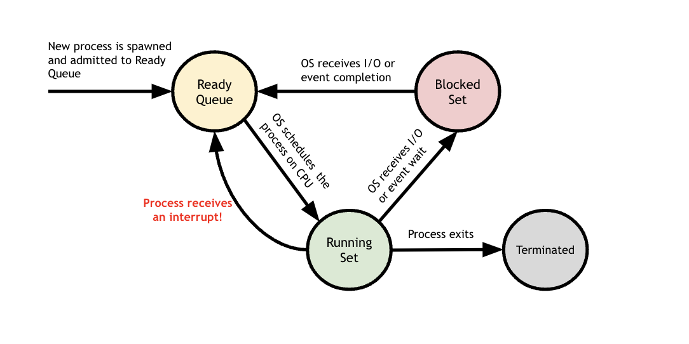
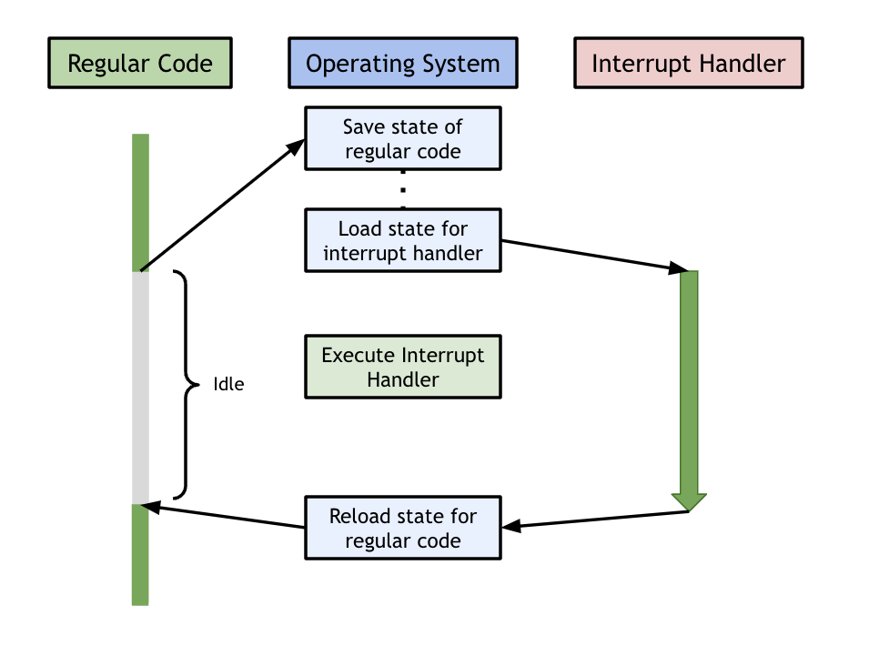

## Interrupts.

#### Introduction

In this lab, we will be working on implementing **interrupts**, which are
at the heart of operating system design. The kernel is responsible for 
keeping track of processes (which may be running on multiple devices) and
ensuring that they run correctly, and to completion. The kernel's job
ends up becoming that of a master scheduler who is responsible for 
overseeing everything that is happening on the machine. Managing everything
that is going on is no easy task. 

One way to understand process management is to think about process state. 
Process state tracks the _state_ of any given process, and allows the 
kernel to make important scheduling decisions about which process should 
run next. Most importantly, the scheduler needs to decide which process 
should have priority to run. The scheduler by might begin by running one
process--called, say, Process B--but will give priority to another 
process--called, say, Process A--if the second process needs immediate 
attention. In other words, the scheduler can choose to _interrupt_ 
Process A by forcing that process to stop running for the time being. 
The scheduler would do this by moving Process A from the running set to 
the ready queue. Here is a diagram to model this:

<table><tr><td>
  
</td></tr></table>

The key idea with interrupts is that we can manage the execution of 
multiple, concurrent processes by ensuring that processes interrupt
one another whenever they need immediate attention. 

This idea of interrupts can be extended further when thinking about how 
an operating system can manage multiple devices at once. The operating
system needs to keep track of what happens to each of these devices. In 
the case something "important" happens to one of these devices, the OS
needs to know immediately so it can appropriately deal with the event 
that just happened and give priority to this device. 

An operating system could try to constantly check what it is happening 
to each of the various devices using a technique known as polling, but 
the system would end up wasting all its time on these checks which 
would make these checks fruitless. If the OS only checked the status 
of these devices periodically then it would only learn about important
changes in the devices well after they happened. Interrupts solve this 
problem by ensuring that the OS can conduct its normal operations, and
that it will be interrupted as soon as an interesting event happens on 
a device it cares about. 

Of course, there are many different types of "interesting" events that
could happen on a device or to a process. When an interesting event does 
happen, the OS wants to know exactly what it should do in response to 
the event that just happened. This is where the idea of an interrupt
handler comes into play. 

An **interrupt handler** is a piece of code associated with a specific
interrupt condition. The interrupt handler is responsible for responding
to the event that just happened by performing the operations that are
necessary in order to service the interrupt. For instance, a timer 
interrupt (which happens when a given amount of time elapses) will 
require a different response than an exception interrupt (which happens
when something goes wrong in a program, such as when we divide by zero). 
Using an interrupt, the OS can ensure that when something important 
happens, it can interrupt the normal code that is running, run the 
interrupt handler for the event that just happened, and then jump back
to the normal code that was running before. 

Interrupts also permit you to write code that may not complete promptly, by giving
you the ability to run it for a given amount, and then interrupt
(pre-empt) it and switch to another thread of control. Operating systems
and runtime systems use this ability to make a pre-emptive threads
package and, later, user-level processes.  The timer interrupt we do
for today's lab will give you the basic framework to do this.

Traditionally interrupts are used to refer to transfers of control
initiated by "external" events (such as a device or timer-expiration).
These are sometimes called asynchronous events.  Exceptions are
more-or-less the same, except they are synchronous events triggered by the
currently running thread (often by the previous or current instruction,
such as a access fault, divide by zero, illegal instruction, etc.)
The framework we use will handle these as well; and, in fact, on the
ARM at a mechanical level there is little difference.

Like everything good, interrupts come at a cost: this will be our
first exposure to race conditions.  If both your regular code and the
interrupt handler read / write the same variables, you have a problem. 
You can have race conditions where both the regular code and the interrupt
handler can overwrite each other's values. In order to avoid this problem, 
we need to save any important values from the regular code that was 
executing, before we switch to the code in the interrupt handler. This
"saving-before-switching" idea is the idea behind what is known as a 
**context switch**. In a context switch, we switch from one piece of code
and all of its relevant variables to another piece of code and all of 
its relevant variables. For this lab, we will be context switching 
between the context of the regular C code and the context of the 
interrupt handler. Here is a diagram illustrating this:

<table><tr><td>
  
</td></tr></table>
