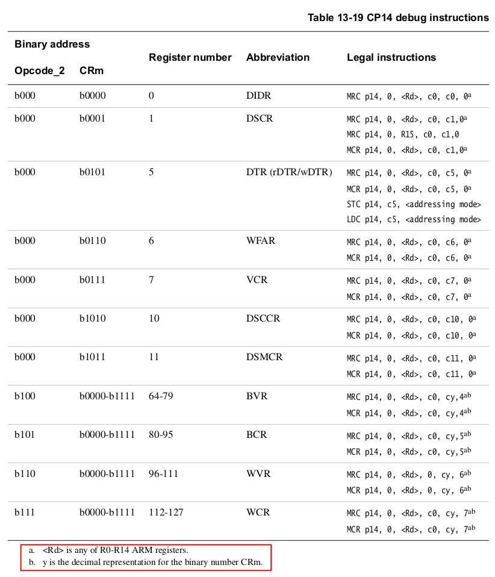
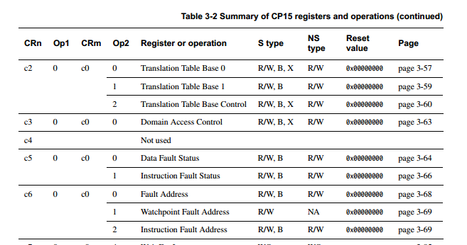

## Debug hardware cheat sheet.

Like most modern machines, the `arm1176jzf` CPU in our r/pi's supports:
  - *watchpoints*: which cause an exception to occur when a load or
    store is performed to a small number of addresses.
  - *breakpoints*: which cause an exception to occur when the CPU attempts to
    execute an instruction at a small number of addresses.
  - *single-stepping*: where an exception occurs for each insturciton executed
    in order.

Most OS designers skip through the debug chapter of any hardware
document ("boring!")  or read it just enough to re-target a `gdb` stub.
I certainly used to!  But this is a mistake.  There's a lot of useful
tricks we can play with this hardware.

Unfortunately, also like many hardware documentation, the ARM1176 document
is written more in definitional voice, where it can be unclear what steps
to perform to  accomplish a goal.  So you have to read chapter 13 with
a goal in mind, gather up the different rules scattered throughout, and
hope you don't miss "must" or "do A before B" edict (there are several
of these!).   
We'll give some of the page numbers below to hopefully make this a bit
easier.  Of course: if you want the full experience just ignore these
hints and go into the chapter raw.  This is certainly the way to learn!

-----------------------------------------------------------------------
### A big single-stepping gotcha

It's an unfortunate truism that hardware manuals often have important
rules buried in the  middle of a chapter, in the middle of a bunch of
other prose.   You have to expect this dynamic and get in the habit of
reading everything very carefully.

This chapter is no different.  If you look at the bottom of page 13-16
you see this major rule for single stepping:

   - "[if a] mismatch occurs while the processor is running in a 
     privileged mode ... it is ignored"

This is major!!   It's very easy to miss this unflagged sentence and
try to do mis-match breakpoints and not be able to figure out what is
going on.  

-----------------------------------------------------------------------
### Useful page index

This is a quick cheat sheet that lists out useful tables, register
definitions, rules, etc.  It's not complete.

Tables:
  - p 13-5: Table 13-1: terms for registers.  (R, W, etc)
  - p 13-5: Table 13-2: the `Opcode_2` and `CRm` values needed to specify
    a debug register (e.g., `WFAR`, `DIDR`, etc). 
  - p 13-26: Table 13-19: summary of debug instructions; useful list of 
    how to read and write.
  - p 13-34: Table 13-23: which cp15 registers get set on which debug events.
  - p 13-36: Table 13-24: link register values after different exceptions.

Pages:
  - p 13-3 (13.2.2): monitor debug-mode: this is what we use.
  - p 13-4 (13.2.4): states it uses modified virtual addresses, but AFAIK we can
    use physical addresses.  
  - 13-6: debug id (`DIDR`) register layout. Useful: gives number of
    watchpoints (2) and breakpoints (6) supported by our CPU.
  - 13-7: debug status and control (`DSCR`): in particular, enable
    the debug mode 

    Subpoints:
      - 13-9: "for the core to take an exception, monitor debug mode
        has to be both selected and enables, bit 14 clear and bit 15 set").
      - 13-11: how to tell which exception occurred (bits `5:2`):
        watchpoint or breakpoint.

        RULE: "must first check IFSR or DFSR to determine a debug
        exception has occured before checking `DSCR`).

  - 13-12: watchpoint fault register (`WFAR`):   holds address of instruction
    that caused the fault.  

    NOTE: as with exceptions, there is a constant added.  For us: `WFAR` is
    addres of instruction plus `0x8`.

    To access:

        mrc p14, 0, <Rd>, c0, c6, 0  ; read wfar
        mcr p14, 0, <Rd>, c0, c6, 0  ; write wfar

    You can derive these values yourself using table 13-2 on p 13-5.

  - 13-16: breakpoint value registers (`BVR`):   

    Values for `CRm` to access different breakpoint registers: `c64-c67`
    (0-3) and `c68-c69` (4-5).   We don't use, but you can tag some with
    a context id (which --- as usual --- implies you have to clear and
    restore when switching processes for those that are not tagged).

    KEY: "IMVA comparison can be programmed to either hit when the
    address matches or *mis-matches*."    Mis-match is how we implement
    single-stepping: set a mismatch on the instruction we jump back
    to so that we will trigger when the next instruction runs (note:
    infinite loop of one instruction won't trigger).

  - 13-17: breakpoint control registers (`BCR`): one for each of the `BVR` 
    registers above (`c80-c83` and `c84-c85`).   

    Bits `22:21` are used to set mismatch (`10`) or match (`01`).

    Breakpoint match in secure and non-secure (bits `15:14=00`)

    The BVR is a word address: use bits `8:5` to program subword matches.

    Privilege: bits `2:1`.

    Breakpoint enabled: bit 0.

  - 13-19: table 13-12: reiterates the bits above that we need to set for
    match (`22:20=000`) and mismatch (`22:20=100`).

 - 13-20: RULE: update of `BVR` or `BCR` needs an `IMB`.  Other rules too,
   but I don't think they affect us.

 - 13-20: watchpoint value register (`WVR`): as with breakpoints,
   watchpoints are controlled using two registers, the `WVR` (which is
   a word address) and the watchpoint control (`WCR`) register.

 - 13-21: watchpoint control register (`WCR`).

   bit `8:5` can control subword matchies.

   bit `4:3` match on load (`01`) or store (`10`) or either (`11).

   bit `0`: enable (1), disable (0).

   RULE: update of `WVR` or `WCR` needs an IMB before you are guaranteed
   it occurs.

 - 13-32: Summary of what leads to the different events: we care about
   watchpoint debug event and breakpoint debug.

   Notice that if you are willing to modify the monitored code you
   can use the `BKPT` instruction to generate an unlimited number of
   different breakpoints.  (In many cases you can also simply insert
   a jump!  A useful trick is to generate machine code at runtime for
   each specific jump breakpoint so you know where you came from.)

 - 13-34: which cp15 registers are written on debug events.

     - `IFSR`: set whenever breakpoint occurs.   Checked in prefetch abort.
     - `DFSR`: set whenever a watchpoint occurs.  Checked by the data abort.
     - `WFAR`: set when watchpoint occurs.  Set to the VA that caused watchpoint
       plus offset (see table 13-25 for offsets).
     - XXX: `IFAR` is always invalid?

     Table 13-23 on p 13-34 summarizes.

  - 13-35: on watchpoint the hardware sets DSCR `5:2` and then sets DFSR, FAR and 
    WFAR as Table 13-23 states.  Jumps to data abort vector and sets up all
    shadows as usual.  Data abort handler must check the `DFSR` bit to see
    if was caused by debug or by regular data abort.

      - If the handler will manipulate the watchpoint, it must disable it or will
        get a recursive fault.
      - The watchpoint address will be in `FAR`.
      - Instruction that faulted in `WFAR`.
      - `R14` holds the faulting instruction (`WFAR`) plus 8.

  - 13-35:  on breakpoint: 
      - Check `DSCR[5:2]`,    
      - IFSR set as table 13-23 describes.  Handler must check this to see if
        its a breakpoint or normal prefetch abort.
      - hardware sets up the normal prefetch abort state.
      - Instruction causing the fault is in `r14` plus 4.

  - 13-45: how to set simple breakpoint.  (not sure: why do we have
    to disable?  is that b/c the current code might trigger?)

  - 13-47: how to set simple watchpoint.  (not sure: why do we have
    to disable?  is that b/c the current code might trigger?)

Things we skip:
 - 13.3.4
 - 13.3.11
 - 13.3.12
 - 13.5.1
 - 13.6
 - 13.7
 - 13.10
 - 13.11

-----------------------------------------------------------------------
### How to issue debug instructions

The arm1176jzf chip we are using has multiple "debug" modes.  We are using
"monitor debug-mode" which just means that you can configure the hardware
to throw exceptions when the contents of a small set of addresses are
read, written or executed.  The manual confusingly refers to the addresses as 
*modified virtual addresses* (MVAs), but as far as I can tell, you can also 
use physical addresses.   (I can't find any sentence that gives us any guarantee
of this, so if you see one let me know!).  

As you should anticipate, the ARM controls the debug functionality
through special co-processor instructions.  For debuging functionality,
that is co-processor 14.

As you can see on page 3-13, the "move from coprocessor" `mrc` and "move to
coprocessor" `mcr` instructions have the format:

    mrc p14, <Opcode_1>, <Rd>, <CRn>, <CRm>, <Opcode_2>  ; read coproc
    mcr p14, <Opcode_1>, <Rd>, <CRn>, <CRm>, <Opcode_2>  ; write coproc

Where:
  - `Rd` is a general purpose register and 
  - `Opcode_1` and `CRn` are both 0 (page 13-5)
  - and `Opcode_2` and `CRm` are determined by the given instruction. 

  - There will typically be a configuration register that controls whether
    the functionality is enabled or disabled.  For us, this is the
    "debug status and control register" (`DSCR`) on 13-7.

Thus, all debug instructions are variations on:

    mrc p14, 0, <Rd>, c0, <CRm>, <Opcode_2>  ; read coproc
    mcr p14, 0, <Rd>, c0, <CRm>, <Opcode_2>  ; write coproc

See below for an example.

The list of the hardware debug registers is on page 13-5 (page 480 in my pdf).

A cheat-sheet of assembly instructions to access these registers (13-26):
<table><tr><td>

</td></tr></table>

When a debug fault happens, the hardware will put additional values in
different fault registers.  A short cheat sheet of the assembly code to
get various of the fault registers:
<table><tr><td>

</td></tr></table>

-----------------------------------------------------------------------------
### Example: Get the debug ID register (DIDR)

As a warmup, implement a routine to get the debug id register (page 13-6)
and use this to determine how many watchpoint and breakpoints our specific
ARM processor provides.

To read the `DIDR` register, we look on page 13-5 in table 13-2 to get the values
for `Opcode_2` and `CRm`.  From the first row:
  - `Opcode_2` is `0`.
  - `CRm` is `c0`.

Substituting these values into our debug instruction template:

    mrc p14, 0, <Rd>, c0, <CRm>, <Opcode_2>  ; read coproc
    mcr p14, 0, <Rd>, c0, <CRm>, <Opcode_2>  ; write coproc

Gives us:

    mrc p14, 0, <Rd>, c0, c0, 0  ; read DIDR 

Note we don't have a write coprocessor version since if you look at the
`DIDR` field definitions on page 13-7 you see they are all read-only.

You can check your logic in doing this for the other instructions (and
ours for this one) by looking on page 13-26, where table 13-19 lists
out all the different debug instructions.

IF you want to write the code for this raw:

    static inline uint32_t cp14_debug_id_get(void) {
        // the documents seem to imply the general purpose register 
        // SBZ ("should be zero") so we clear it first.
        uint32_t ret = 0;

        asm volatile ("mrc p14, 0, %0, c0, c0, 0" : "=r"(ret));
        return ret;
    }

Or, `armv6-debug.h` provides some macros to make this more concise:

    // This macro invocation creates a routine called cp14_debug_id_macro
    // that is equivalant to <cp14_debug_id_get>
    //
    // you can see this by adding "-E" to the gcc compile line and inspecting
    // the output.
    cp_asm_get(debug_id, p14, 0, c0, c0, 0)

A couple useful ones for the lab:

    cp_asm(cp14_bvr0, p14, 0, c0, c0, 4)
    cp_asm(cp14_bcr0, p14, 0, c0, c0, 5)
